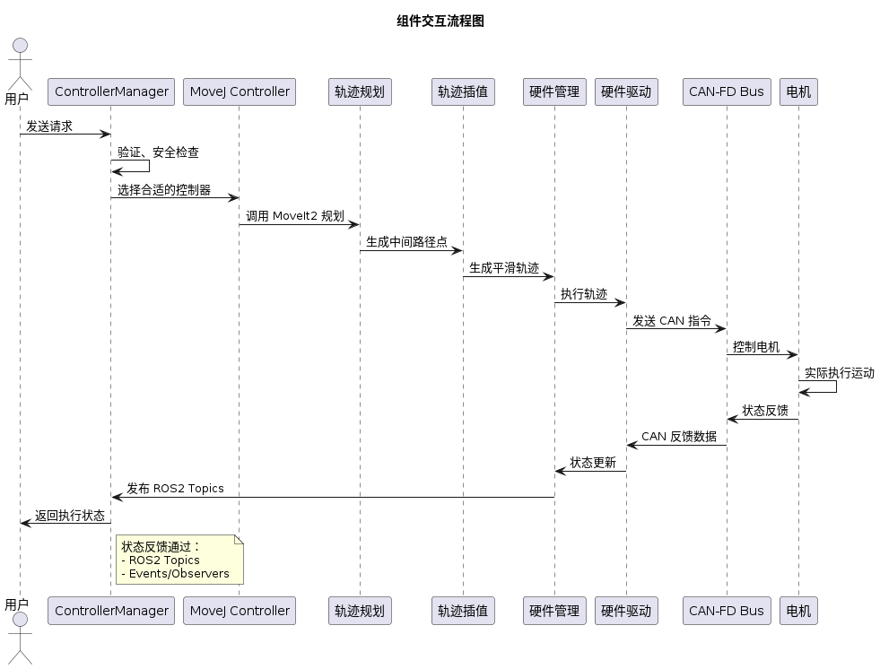
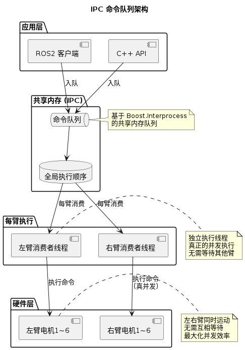
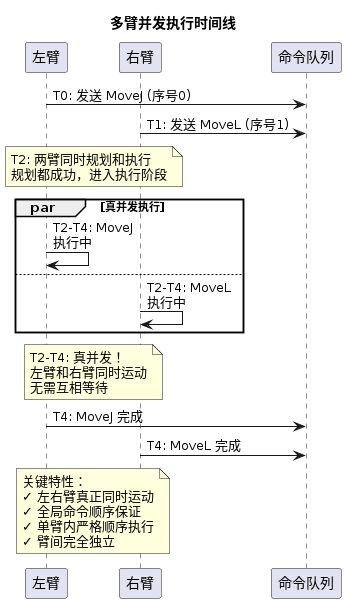

# 系统架构

Universal Arm Controller 的总体架构设计与设计理念。

## 📋 目录

- [架构总览](#架构总览)
- [分层架构](#分层架构)
- [组件交互](#组件交互)
- [设计理念](#设计理念)

---

## 架构总览

Universal Arm Controller 采用**三层分层架构** + **模块化组件设计**：

```
┌─────────────────────────────────────────────────────────────┐
│         应用层 (ROS2 Nodes / User Applications)              │
├─────────────────────────────────────────────────────────────┤
│  ControllerManager         │         TrajectoryController    │
│  (Mode Control)            │         (Trajectory Execution)  │
├─────────────────────────────────────────────────────────────┤
│                 控制层 (Motion Control)                       │
│  Trajectory Planning  │  Trajectory Interpolator             │
│  (Path Planning)      │  (Smooth Trajectory)                 │
├─────────────────────────────────────────────────────────────┤
│            硬件层 (Hardware Abstraction)                      │
│         Hardware Driver (CAN-FD Motor Control)               │
├─────────────────────────────────────────────────────────────┤
│                  物理硬件 (CAN-FD Bus / Motors)              │
└─────────────────────────────────────────────────────────────┘
```

---

## 分层架构

### 第一层：应用层

**负责**：用户交互、模式管理、系统状态

**核心组件**：
- **ControllerManager** - 控制器管理和模式切换
- **TrajectoryController** - 轨迹执行控制
- **ROS2 Interfaces** - 服务、话题、动作

**特点**：
- 提供统一的 ROS2 接口
- 隐藏下层复杂性
- 支持多种控制模式

---

### 第二层：控制层

**负责**：轨迹规划、路径生成、运动学计算

**核心库**：
- **Trajectory Planning** - 基于 MoveIt2 的规划
- **Trajectory Interpolator** - 实时轨迹插值

**功能**：
- 路径规划与碰撞检测
- 逆运动学求解
- 轨迹平滑与动力学约束满足

---

### 第三层：硬件层

**负责**：底层硬件通信、电机控制

**核心库**：
- **Hardware Driver** - CAN-FD 通信与电机驱动

**特点**：
- 高性能：微秒级延迟
- 线程安全：CPU 亲和性绑定
- 灵活：事件驱动 + 观察者模式

---

## 组件交互

<div align="center">



</div>

### 关键数据结构

1. **关节状态** - sensor_msgs/JointState
2. **任务指令** - geometry_msgs/Pose 或 sensor_msgs/JointState
3. **轨迹** - trajectory_msgs/JointTrajectory
4. **电机指令** - CAN-FD 格式的控制字

---

## IPC 命令队列架构

### 概述

Universal Arm Controller 采用基于 **Boost.Interprocess** 的 IPC 命令队列来实现多臂并发控制。该架构提供了：

- **真并发**: 多个手臂可以同时执行不同的命令（真正的并行控制，无需等待）
- **安全顺序执行**: 单个手臂内的命令按照全局执行顺序依次执行
- **低延迟**: 微秒级的命令分发和执行
- **线程安全**: 采用每映射锁保证数据一致性

### 架构设计

<div align="center">



</div>

### 执行流程

```
1. 命令入队 (Enqueue)
   - C++ API: controller.move(target)
   - ROS2 API: topic pub /controller_api/movej_action/...
   ↓
2. 共享内存存储
   - 写入到 IPC 队列
   - 记录全局执行顺序
   ↓
3. 每臂消费线程 (Independent Execution)
   - 从队列取出属于该臂的命令
   - 按全局顺序执行该臂的命令
   - 线程安全: 每映射一个互斥锁
   ↓
4. 真并发执行
   - 臂 A 执行其命令（无需等待臂 B）
   - 臂 B 同时执行其命令（无需等待臂 A）
   - 每臂内严格顺序，臂间完全并发
   ↓
5. 状态反馈
   - 完成后通知应用
   - 发布 ROS2 话题
```

### 控制器的 IPC 支持

各控制器通过 `move()` 方法和 `command_queue_consumer_thread()` 实现 IPC 支持：

- **MoveJController** - 支持 IPC 指令，执行关节空间轨迹规划
- **MoveLController** - 支持 IPC 指令，执行笛卡尔空间直线运动
- **MoveCController** - 支持 IPC 指令，执行笛卡尔空间圆弧运动
- **JointVelocityController** - 支持 IPC 指令，实时关节速度控制
- **CartesianVelocityController** - 支持 IPC 指令，基于 QP 的笛卡尔速度控制

### 多臂并发控制示例

<div align="center">



</div>
---

## 设计理念

### 1. 分离关注点

- **应用层**与**硬件层**隔离
- 便于独立测试和维护
- 支持多种硬件替换

### 2. 模块化

- 各组件可独立使用
- 清晰的接口定义
- 最小化依赖耦合

### 3. 实时性

- 低延迟设计
- 事件驱动架构
- 精确的时序控制
- **IPC 命令队列**: 微秒级命令分发

### 4. 可靠性

- 多层安全检查
- 限位保护机制
- 异常处理
- **线程安全**: 全局执行顺序 + 每映射锁

### 5. 易用性

- 统一的 ROS2 接口
- 完整的文档
- 丰富的示例
- **双接口**: ROS2 + C++ API

---

## 工作流程示例

### MoveJ 控制流程

```
1. 用户发送 MoveJ 目标关节角度
   ros2 topic pub /controller_api/movej_action/single_arm sensor_msgs/msg/JointState

2. Arm Controller 接收并验证
   - 检查目标是否在关节限制内
   - 检查碰撞风险

3. 调用轨迹规划
   - MoveIt2 进行路径规划
   - 生成中间路径点

4. 轨迹插值
   - 在路径点间生成光滑轨迹
   - 满足速度/加速度约束

5. 硬件执行
   - 从轨迹中提取控制指令
   - 通过 CAN-FD 发送到电机

6. 状态反馈
   - 电机返回当前位置/速度
   - 发布 ROS2 Topics
   - 可选的事件触发
```

### 状态转换流程

<div align="center">


</div>
---

## 性能考虑

### 延迟路径

1. **应用层延迟** - ROS2 通信（1-2 ms）
2. **规划延迟** - 轨迹规划（50-500 ms）
3. **插值延迟** - 轨迹生成（< 1 ms）
4. **硬件延迟** - CAN 通信 + 电机响应（200 μs）

**总延迟** - 规划主导（通常 < 1 s）

### 优化策略

- 规划的结果缓存
- 异步规划执行
- 优先级队列管理

---

## 可扩展性

### 支持的扩展

1. **新硬件** - 替换 Hardware Driver
2. **新规划算法** - 扩展 Trajectory Planning
3. **新控制模式** - 添加新的 Controller
4. **新的传感器** - 扩展 Feedback 系统

### 设计原则

- 接口驱动设计
- 插件式架构
- 配置驱动行为

---

## 下一步

本文档介绍了 Universal Arm Controller 的总体系统架构。如需了解 Arm Controller 子模块的详细设计（双节点架构、控制器设计、线程模型等），请查看以下文档：

- 📖 **[Arm Controller 详细架构](../src/arm_controller/docs/ARCHITECTURE.md)** - 包含双节点设计、控制器架构、线程模型、配置管理等详细内容
- ⚙️ **[配置指南](../src/arm_controller/docs/CONFIGURATION.md)** - 系统配置参数说明
- 👨‍💻 **[开发指南](../src/arm_controller/docs/DEVELOPER.md)** - 开发流程和扩展指南

---

**更多信息请访问 [文档中心](README.md)。**
