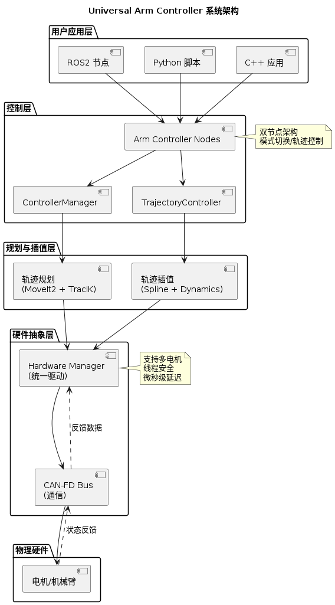

# 系统概览

Universal Arm Controller 系统组件与架构简介。

## 📋 目录

- [系统概览](#系统概览)
- [核心组件](#核心组件)
- [依赖库](#依赖库)
- [系统架构](#系统架构)
- [数据流](#数据流)

---

## 系统概览

Universal Arm Controller 是一个完整的机械臂控制系统解决方案，采用模块化架构，由多个独立组件组成。整个系统分为三层：

1. **应用层** - ROS2 节点和控制器
2. **控制层** - 轨迹规划和插值
3. **硬件层** - CAN-FD 通信和电机驱动

---

## 核心组件

### 本仓库维护的组件

#### 1. Arm Controller（运动控制核心）
**位置**: `src/arm_controller/`

运动控制系统的核心组件，负责：
- ✅ **6+ 控制模式**：MoveJ、MoveL、MoveC、JointVelocity、CartesianVelocity、HoldState
- ✅ **IPC 命令队列架构**：多臂真并发控制，单臂安全顺序执行
- ✅ 状态管理与模式切换
- ✅ 安全监控与限位保护
- ✅ ROS2 接口与服务
- ✅ MoveIt2 集成

**特性**:
- 双节点架构：ControllerManager + TrajectoryController
- **原生双臂支持**：基于 IPC 命令队列的真并发控制
- **双接口模式**：ROS2 发布/订阅 + C++ API（move() 方法）
- 事件驱动的状态监控
- 微秒级控制延迟
- **3层安全检查**：前置几何可行性检查 + QP 求解 + 后置方向验证（CartesianVelocity）

**控制模式详情**:
- **MoveJ** - 关节空间点到点运动（轨迹规划 + 插值）
- **MoveL** - 笛卡尔空间直线运动（逆运动学 + 插值）
- **MoveC** - 笛卡尔空间圆弧运动（参数化圆弧 + 插值）
- **JointVelocity** - 实时关节速度控制（MIT 模式）
- **CartesianVelocity** - 基于 QP 的笛卡尔速度控制（逆速度雅可比 + 安全验证）
- **HoldState** - 保持当前位置（闭环力矩控制）

**文档**: [Arm Controller 文档中心](../src/arm_controller/docs/README.md)

#### 2. Controller Interfaces（ROS2 消息定义）
**位置**: `src/controller_interfaces/`

定义系统中使用的所有 ROS2 消息和服务：
- 工作模式切换服务
- 关节状态消息
- 控制命令消息
- 系统状态消息

#### 3. Robotic Arm Bringup（系统启动）
**位置**: `src/robotic_arm_bringup/`

系统启动和配置：
- ROS2 启动文件
- YAML 配置文件
- 参数管理

---

## 依赖库

### Hardware Driver（CAN-FD 硬件驱动）
**GitHub**: [Ding-Kaiyue/hardware-driver](https://github.com/Ding-Kaiyue/hardware-driver)

提供硬件级别的电机控制能力：
- CAN-FD 高速通信（支持 CAN 2.0 和 CAN-FD）
- 实时电机控制（位置、速度、力矩、MIT 模式）
- 事件驱动的状态监控
- 观察者模式与事件总线
- 线程安全设计
- 微秒级控制延迟

**关键特性**:
- 支持多个电机并发控制
- CPU 亲和性绑定
- 背压控制机制

---

### Trajectory Interpolator（轨迹插值库）
**GitHub**: [Ding-Kaiyue/trajectory-interpolator](https://github.com/Ding-Kaiyue/trajectory-interpolator)

提供实时的轨迹插值能力：
- 样条曲线插值（B-spline、Bezier）
- 动力学约束满足（速度、加速度、加加速度）
- 实时轨迹生成
- 运动平滑处理

**应用场景**:
- 从规划的路径生成光滑的执行轨迹
- 满足机械臂的动力学限制
- 实时生成控制指令

---

### Trajectory Planning（轨迹规划库）
**GitHub**: [Ding-Kaiyue/trajectory-planning](https://github.com/Ding-Kaiyue/trajectory-planning)

基于 MoveIt2 的轨迹规划能力：
- 多种规划算法集成（RRT、RRTConnect 等）
- 碰撞检测与避障
- 逆运动学求解（通过 TracIK）
- 路径优化

**应用场景**:
- MoveJ 和 MoveL 控制的路径规划
- 碰撞检测和避障
- IK 求解

---

## 系统架构

### 整体架构图

<div align="center">



</div>

### 分层设计

1. **应用层** - ROS2 节点、用户应用程序
2. **规划层** - 轨迹规划、路径生成
3. **控制层** - 轨迹执行、插值生成
4. **硬件层** - CAN-FD 通信、电机控制

---

## 数据流

### 1. MoveJ 命令流

```
用户输入
  ↓
MoveJ 控制器
  ↓
轨迹规划 (MoveIt2)  ← 碰撞检测
  ↓
轨迹插值生成
  ↓
硬件驱动
  ↓
电机执行
  ↓
状态反馈
  ↓
用户反馈
```

### 2. 状态反馈流

```
电机状态
  ↓
CAN-FD 接收
  ↓
硬件驱动处理
  ↓
事件总线/观察者
  ↓
用户应用
```

---

## 通信方式

### ROS2 接口

**服务**:
- 模式切换: `/controller_api/controller_mode`
- 系统状态查询

**话题**:
- 关节状态: `/joint_states`
- 控制命令: `/controller_api/*_action`
- 系统状态: `/controller_api/running_status`

### CAN-FD 协议

- 波特率: 5000 kbit/s (CAN-FD)
- 帧格式: 扩展 CAN 帧
- 实时性: 微秒级延迟

---

## 性能指标

基于 Jetson Orin 平台的典型性能：

| 指标 | 数值 |
|------|------|
| **控制延迟** | < 200 μs |
| **状态更新频率** | 2.5 kHz (高频) / 20 Hz (低频) |
| **CPU 使用率** | < 5% |
| **内存占用** | < 50 MB |
| **电机支持数** | 数百个 |

---

## 下一步

- 🚀 查看 [快速开始](QUICKSTART.md)
- 📖 学习 [Arm Controller 架构](../src/arm_controller/docs/ARCHITECTURE.md)
- ⚙️ 查看 [系统配置](../src/arm_controller/docs/CONFIGURATION.md)
- 🏗️ 了解 [完整系统架构](ARCHITECTURE.md)

---

**需要更多信息？** 访问 [文档中心](README.md) 查看完整文档。