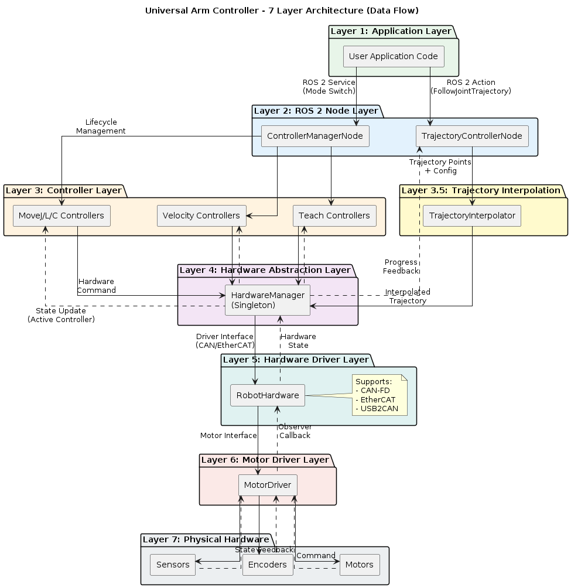
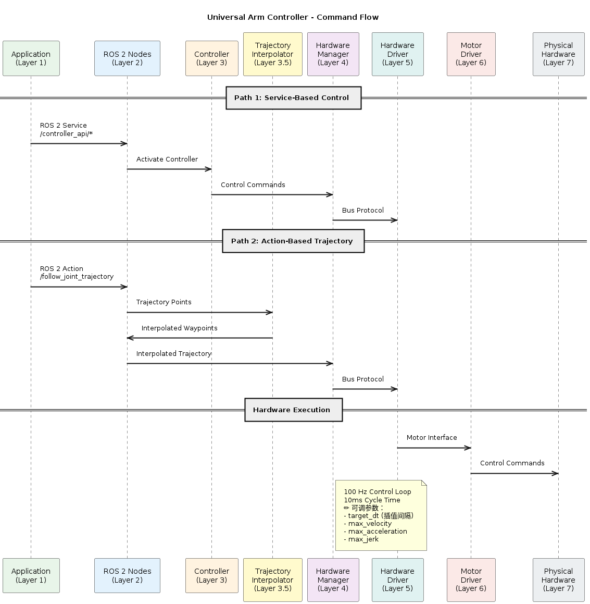
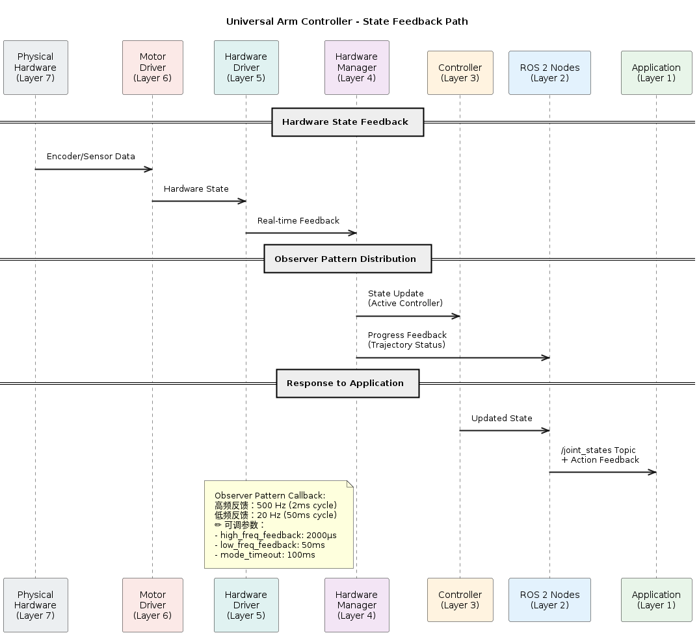
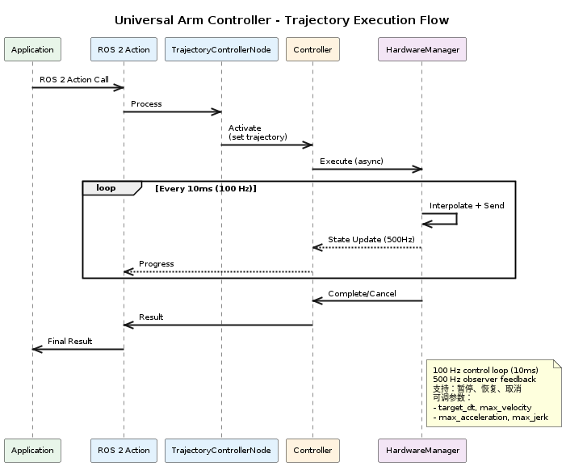
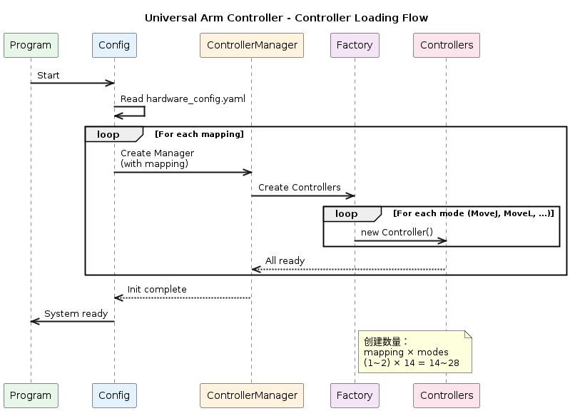

# Universal Arm Controller - Architecture Design

## 1. 设计目标与架构原则

### 设计目标

Universal Arm Controller 的架构设计目标是：

- **屏蔽硬件差异**：通过统一的硬件抽象接口，支持不同总线（CAN-FD / EtherCAT）和电机驱动
- **控制模式可插拔**：支持多种控制模式（轨迹、速度、示教等），新模式可独立开发和注册
- **ROS 2 原生集成**：基于 ROS 2 Action/Topic/Service，与 ROS 生态无缝集成
- **实时性与可维护性平衡**：在 100 Hz 控制频率下保证稳定性，同时保持代码清晰

### 架构约束

- **不提供硬实时保证**：系统运行在标准 Linux + ROS 2，无法保证 < 1 μs 抖动
- **轨迹规划职责分工**：MoveJ 依赖 MoveIt2 规划，MoveL/MoveC 使用自有轨迹生成算法
- **不包含硬件安全回路**：提供软件级急停逻辑，但不包含硬件抱闸或功能安全（SIL 2/3）认证
- **支持多臂控制**：主分支支持单臂，`feature/ipc-dual-arm` 分支支持双臂协同控制

### 关键设计原则

1. **分层解耦**：应用层、控制层、硬件层职责清晰分离
2. **观察者模式**：硬件状态变化通过事件回调通知上层，而非轮询
3. **模式切换安全**：同一时刻只有一个控制器活跃，切换时进行状态验证
4. **自定义注册机制**：不依赖 pluginlib，通过 YAML 配置驱动控制器注册
5. **接口稳定性**：ROS 2 接口（`/controller_api/*`）向后兼容，硬件接口仅供内部使用

---

## 2. 系统整体分层架构

### 分层结构

分为 7 层，从上到下的数据流向：



### 各层职责概览

| 层级 | 职责 | 可替换性 |
|------|------|--------|
| Layer 1: Application Layer | 发送控制命令，接收状态反馈 | 用户代码，不属于本系统 |
| Layer 2: ROS 2 Node Layer | 管理控制器生命周期、模式切换、轨迹动作处理 | 核心稳定，不建议替换 |
| Layer 3: Controller Layer | 实现具体控制模式（MoveJ/MoveL/速度/示教等） | 强烈推荐扩展新模式 |
| Layer 3.5: Trajectory Interpolation | 轨迹插值、平滑处理 | 可替换，需谨慎 |
| Layer 4: Hardware Abstraction Layer | 统一硬件接口、异步执行、观察者模式 | 稳定接口，不建议修改 |
| Layer 5: Hardware Driver Layer | RobotHardware 驱动（CAN-FD/EtherCAT/USB2CAN） | 推荐扩展新总线 |
| Layer 6: Motor Driver Layer | 具体电机协议实现 | 推荐扩展新电机 |
| Layer 7: Physical Hardware | 电机、编码器、传感器 | 不可修改（物理硬件） |

### 数据流与控制流方向

**命令流向（从上到下）**：


**状态反馈路径（从下到上）**：


> [!IMPORTANT]
> 系统采用**开环轨迹执行**模式：执行前读取一次当前位置用于规划，规划完成后按轨迹逐步执行，不进行反馈控制。状态反馈（500Hz/20Hz）用于应用层监测和显示，不参与轨迹跟踪。

---

## 3. 核心运行时组件

> [!TIP]
> 本节从系统级视角描述 Universal Arm Controller 的核心结构单元及其依赖关系，用于支持架构评审与系统级理解。
> 后续 3.1–3.4 小节将分别对上述四个结构单元中的关键实现组件进行展开说明，面向具体扩展开发者。

### 3.0 系统级架构视角（Architecture View）

本系统采用**四层结构单元**设计，通过明确的职责边界和单向依赖实现模块独立演进。

#### 结构单元划分

**1. 控制编排单元（Control Orchestration）**
- 核心组件：ControllerManager
- 职责：管理控制器生命周期、模式切换、状态机维护
- 特点：单一活跃原则、原子性切换、决策中心

**2. 控制策略单元（Control Strategy）**
- 核心组件：5 个基类 + 多个具体控制器实现  
- 职责：实现多种控制模式（轨迹、速度、示教等）  
- 特点：工厂注册、热插拔、独立演进能力强 

**3. 算法单元（Algorithm Layer）**
- 核心组件：轨迹生成、插值器、平滑器  
- 职责：提供纯数学计算能力（无业务逻辑）  
- 特点：无 ROS 依赖、可完全替换  

**4. 硬件抽象单元（Hardware Abstraction）**
- 核心组件：HardwareManager + RobotHardware 接口  
- 职责：统一硬件接口、屏蔽总线差异、执行命令、采集反馈  
- 特点：观察者模式、异步执行、稳定接口 

#### 系统级约束与依赖方向

系统采用严格的**单向依赖结构**：
```
Control Orchestration
    ↓
Control Strategy (调用 Algorithm + Hardware)
    ↓
Algorithm Layer + Hardware Abstraction
```

**明确禁止**：
- 硬件层反向调用控制器
- 算法层包含业务逻辑
- 控制器绕过 HardwareManager 直接访问底层硬件

通过上述四个结构单元的划分，本系统的宏观运行结构可以被理解为：

- 由 **Control Orchestration** 负责全局调度与状态机控制；
- 由 **Control Strategy** 承载具体的控制模式与业务逻辑；
- 由 **Algorithm Layer** 提供可替换的纯算法能力；
- 由 **Hardware Abstraction** 屏蔽具体硬件差异并执行底层命令。

这一视角用于回答“系统由哪些结构单元组成，以及它们之间如何协作”的问题，它刻画的是**架构级依赖关系**，而非具体类或文件结构。

在接下来的章节中，文档将从这一系统级视角下沉到**具体运行时组件层面**，逐一说明这些结构单元在代码中的实际承载者及其职责边界。

### 3.0.1 ControllerManager（控制编排器）

在系统级结构单元划分中，**Control Orchestration** 结构单元的核心实现载体即为 ControllerManager。

从本节开始，文档将从“结构单元”层面切换到“具体运行时组件”层面，  
对每一个关键组件说明：

- 其在整体架构中的位置  
- 承担的核心职责  
- 与上下层的依赖关系  
- 以及在代码中的实现位置  

ControllerManager 是系统的**全局调度中心**，负责控制器生命周期管理、模式切换和系统状态机维护。

**位置**：`src/arm_controller/src/controller_manager_section.hpp/cpp`

**职责**：
- 管理所有控制器的生命周期（创建、初始化、激活、停用、销毁）
- 处理模式切换请求，确保同一时刻只有一个控制器活跃
- 维护模式切换状态机（normal → hook_state → normal）
- 管理多臂配置（支持 single_arm/left_arm/right_arm）
- 初始化和管理 HardwareManager 单例

### 3.1 各类 Controller（具体控制器）

在系统级结构单元划分中，所有具体控制模式均属于 **Control Strategy** 结构单元的实现部分。

本节所描述的各类 Controller：

- 是系统中**业务逻辑的主要承载者**  
- 直接实现不同控制模式（轨迹、速度、示教、工具模式等）  
- 通过统一基类体系与 ControllerManager 受控调度  
- 并通过 Algorithm Layer 与 Hardware Abstraction 间接访问算法与硬件  

理解这一层的设计，对于：

- 扩展新控制模式  
- 评估系统可演化性  
- 判断架构稳定边界  

具有关键意义。

**实现位置**：`src/arm_controller/src/controller/`

系统提供 5 个基类和 14 个具体控制器实现。新的控制模式可通过继承相应基类并在 `controller_registry.cpp` 中注册来添加。

**5 个基类**：
1. **ModeControllerBase** - 所有控制器的基类
2. **VelocityControllerBase** - 速度控制基类
3. **TrajectoryControllerBase** - 轨迹控制基类
4. **UtilityControllerBase** - 工具类控制器基类
5. **TeachControllerBase** - 示教模式基类

**当前控制器实现**：

| 控制模式 | 控制器类 | 基类 | 职责 |
|---------|---------|------|------|
| MoveJ | MoveJController | TrajectoryControllerBase | 关节空间点到点运动 |
| MoveL | MoveLController | TrajectoryControllerBase | 直线运动 |
| MoveC | MoveCController | TrajectoryControllerBase | 圆弧插补运动 |
| JointVelocity | JointVelocityController | VelocityControllerBase | 手动控制 |
| CartesianVelocity | CartesianVelocityController | VelocityControllerBase | 遥操作 |
| PointRecord | PointRecordController | TeachControllerBase | 示教（点位记录） |
| PointReplay | PointReplayController | TeachControllerBase | 点位回放 |
| TrajectoryRecord | TrajectoryRecordController | TeachControllerBase | 轨迹示教（轨迹记录） |
| TrajectoryReplay | TrajectoryReplayController | TeachControllerBase | 轨迹回放 |
| Move2Start | Move2StartController | UtilityControllerBase | 系统启动（移至启动位置） |
| Move2Initial | Move2InitialController | UtilityControllerBase | 初始化（移至初始位置） |
| HoldState | HoldStateController | UtilityControllerBase | 安全切换模式（保持当前状态） |
| SystemStart | SystemStartController | UtilityControllerBase | 系统启动 |
| ROS2ActionControl | ROS2ActionControlController | UtilityControllerBase | ROS2 动作控制 |

**控制器注册机制**：
- 使用工厂模式（Factory Pattern）
- 注册文件：`controller_registry.cpp`
- 在 ControllerManager 初始化时从工厂加载

### 3.2 Hardware Manager（硬件管理器）

**位置**：`src/arm_controller/src/hardware/hardware_manager.cpp`

**职责**：
- 提供统一的硬件抽象接口（屏蔽 CAN-FD / EtherCAT 差异）
- 采用单例模式管理硬件驱动实例
- 异步轨迹执行（支持整条轨迹的暂停、恢复、取消）
- 关节限位检查和安全保护
- 电机使能/失能、模式切换
- 计算重力补偿力矩
- 实现观察者模式，将硬件状态变化通知给活跃控制器（高频回调 500Hz）

### 3.3 Trajectory Interpolator（轨迹插值器）

**位置**：`src/trajectory_interpolator/`

**职责**：
- 将规划器生成的轨迹点插值为实时指令（100 Hz）
- 使用插值算法保证平滑性
- 处理时间同步和边界条件
- 支持轨迹约束检查（速度、加速度、加加速度）

### 3.4 Trajectory Smoother（轨迹平滑器）

**位置**：`src/arm_controller/src/controller/trajectory_record/`

**职责**：
- 对示教录制的轨迹进行平滑处理（当前实现包括 CSAPS 平滑和原始数据两种策略）
- 仅在示教类控制器中使用
- 不参与实时控制路径

**设计说明**：
- 当前系统基于 **TOTG（Time-Optimal Trajectory Generation）** 算法进行轨迹生成
- 通过策略模式支持多种平滑算法实现的灵活切换

---

## 4. 控制器生命周期与调度模型

### 控制器生命周期

**生命周期状态**：

> [!IMPORTANT]
> 控制器遵循完整的生命周期循环：
> **创建 → 初始化 → 激活 → 执行 → 停用 → (循环)**
> 
> 这个循环确保在模式切换时能够正确清理资源。


**关键状态转换**：
- **创建**：通过工厂在 ControllerManager 中创建
- **初始化**：ControllerManager 初始化时调用
- **激活**：模式切换时启动，初始化订阅
- **执行**：处理订阅的命令/轨迹
- **停用**：模式切换到其他模式时停止

### 模式切换机制

**ROS 2 服务接口**：
- 服务：`/controller_api/controller_mode`
- 参数：mapping（机器人映射）、mode（目标模式）

**模式切换的安全保证**：

1. **验证阶段**：检查目标控制器是否存在且已初始化
2. **停用阶段**：调用当前活跃控制器的停止方法，等待其完成清理
3. **钩子状态处理**：如果当前控制器的停止需要钩子状态，则切换到HoldState
4. **激活阶段**：调用目标控制器的启动方法，初始化新模式的订阅
5. **原子性**：模式切换过程中，不允许新的命令进入

### 实时调度路径

**ROS 2 节点架构**：

```
main()
  ├── ControllerManagerNode 创建（硬件初始化）
  ├── 100ms 延迟（确保硬件完全初始化）
  ├── TrajectoryControllerNode 创建（订阅轨迹）
  └── executor.spin()
```

**轨迹执行路径**：


**关键约束**：
- 异步执行不阻塞 ROS 2 事件循环
- 每个硬件命令调用必须在 10ms 内完成（100Hz 控制周期）
- 状态反馈通过观察者回调异步处理
- 同一时刻最多只有一个轨迹在执行

---

## 5. 插件化与扩展机制

### 自定义注册机制

**实现位置**：`src/arm_controller/src/controller/controller_registry.cpp`

本系统采用工厂模式（Factory Pattern）的自定义注册机制，不依赖 pluginlib。

**注册流程**：
1. 编译时，注册函数将控制器创建器存储在全局工厂中
2. 运行时，ControllerManager 通过工厂创建对应的控制器实例
3. 配置文件（YAML）中指定要启用哪些控制器

**优势**：
- 不依赖动态加载（更安全、更高效）
- 编译时检查类型安全
- 易于调试和控制版本

### 多臂配置与映射

**映射概念**：
- `single_arm` - 单臂配置
- `left_arm` - 双臂左臂
- `right_arm` - 双臂右臂

**配置文件位置**：`config/hardware_config.yaml`

**加载流程**：


### 新控制模式的扩展步骤

**第 1 步**：继承合适的基类
- 位置：`src/arm_controller/src/controller/your_mode/`
- 继承 TrajectoryControllerBase、VelocityControllerBase 或 UtilityControllerBase

**第 2 步**：实现核心方法
- 实现生命周期方法（start、stop、init_subscriptions）
- 实现控制逻辑

**第 3 步**：注册控制器
- 在实现文件中添加注册代码
- 使用工厂的 registerController 方法

**第 4 步**：编译和测试
- 编译：`colcon build --packages-select arm_controller`
- 启动系统：`ros2 launch arm_controller bringup.launch.py`
- 切换模式：`ros2 service call /controller_api/controller_mode ...`

### 新硬件驱动的扩展步骤

**第 1 步**：实现硬件驱动接口
- 位置：`src/hardware_driver/src/driver/`
- 继承 RobotHardware 接口

**第 2 步**：实现总线通信
- 实现底层总线协议
- 实现状态反馈读取

**第 3 步**：在 HardwareManager 中注册驱动
- 位置：`src/arm_controller/src/hardware/hardware_manager.cpp`
- 在 `initialize()` 方法中：
  - 调用工厂函数创建驱动实例（如 `createCanFdMotorDriver()`）
  - 传入硬件配置（从 `hardware_config.yaml` 加载的 interface 列表）
  - 创建 RobotHardware 实例并关联驱动
  > [!WARNING]
  > 当前实现硬编码使用 CAN-FD，如需支持其他总线需替换

---

## 6. 关键接口与抽象边界（Architectural Boundaries）

本章定义的是本系统中**最重要的一组架构边界**。

这些边界并非仅用于模块解耦，而是明确规定：

- 哪些职责必须由哪一层承担  
- 哪些方向的依赖是被允许的  
- 哪些调用关系在架构层面是**被禁止的**  

对于系统演化而言，本章所定义的边界构成了：

- 系统的**稳定内核（Stable Core）**  
- 以及未来扩展时**最不应该被破坏的部分**  

从架构视角看，本系统存在三条最关键的控制边界：

1. **ROS 2 节点 ↔ 控制器（编排边界）**  
2. **控制器 ↔ 硬件抽象层（执行边界）**  
3. **控制器 ↔ 算法层（计算边界）**  

下面分别对这三条边界进行正式定义。

---

### 6.1 ROS 2 节点 ↔ 控制器 的边界（编排边界）

该边界定义了：

> **系统调度职责** 与 **具体控制逻辑职责** 的分离。

在该边界之上的是 **ControllerManager（编排者）**，  
在该边界之下的是 **各类具体 Controller（执行者）**。

#### ControllerManager 的职责（调度侧）

ControllerManager 作为系统的**唯一编排中心**，其职责限定为：

- 管理所有控制器的生命周期  
  - 创建 / 初始化 / 激活 / 停用 / 销毁  
- 处理 ROS 2 服务请求（模式切换）  
- 维护全局状态机（normal ↔ hook_state ↔ normal）  
- 保证**同一时刻仅有一个控制器处于活跃状态**  
- 决定“何时切换”“切换到哪个控制器”  

ControllerManager **不承担**：

- 任何具体控制算法  
- 任何轨迹生成或插值逻辑  
- 任何硬件通信细节  

它是一个**纯调度与编排组件**。

#### Controller 的职责（执行侧）

Controller 作为系统的**业务逻辑承载者**，其职责限定为：

- 实现具体的控制模式逻辑（轨迹、速度、示教等）  
- 被动订阅 ROS 2 Topic / Action 接收命令  
- 在激活期间独占系统执行权  
- 通过 HardwareManager 间接访问硬件  

Controller **明确不允许**：

- 直接调用 ROS 2 Service 进行模式切换  
- 直接创建或销毁其他控制器  
- 直接操作底层硬件驱动  

该边界保证了：

- **调度权集中于 ControllerManager**  
- **控制权集中于当前活跃 Controller**  
- 系统状态机具有**唯一决策源**  

---

### 6.2 控制器 ↔ 硬件抽象层 的边界（执行边界）

该边界定义了：

> **控制算法** 与 **硬件实现细节** 的彻底隔离。

在该边界之上的是 **Controller（控制决策）**，  
在该边界之下的是 **HardwareManager + RobotHardware（执行实现）**。

#### Controller 的职责（控制侧）

Controller 在该边界上的职责限定为：

- 生成控制命令（位置 / 速度 / 力矩）  
- 决定控制时序与控制策略  
- 不关心底层通信方式（CAN-FD / EtherCAT / 其他）  
- 不关心具体电机协议与帧格式  

Controller 只与：

- HardwareManager 提供的**抽象接口**交互  

#### HardwareManager 的职责（执行侧）

HardwareManager 在该边界上的职责限定为：

- 提供统一的硬件抽象接口（屏蔽总线与驱动差异）  
- 管理 RobotHardware 驱动实例  
- 执行轨迹：开始 / 暂停 / 恢复 / 取消  
- 进行关节限位检查与基础安全保护  
- 计算并注入重力补偿力矩  
- 通过观察者模式，将硬件状态变化回调给控制器  

HardwareManager **明确不允许**：

- 反向调用 Controller 的业务逻辑  
- 参与任何控制策略决策  
- 解析 ROS 2 消息或处理模式切换  

> [!NOTE]
> 具体的硬件协议实现（如 CAN-FD 帧格式、电机通信协议）  
> 位于 `hardware_driver/src/driver/` 中的 MotorDriver  
> 以及 `hardware_driver/src/protocol/` 中的 motor_protocol。  
>  
> 这些实现细节被**严格限制在硬件驱动层内部**，  
> 不允许向控制层或编排层泄漏。

该边界保证了：

- 控制器可以在**不修改任何控制逻辑**的情况下替换硬件总线  
- 新硬件驱动的引入不会影响上层控制模式  
- 硬件相关复杂性被**完全封装在系统底部**  

---

### 6.3 控制器 ↔ 算法层 的边界（计算边界）

该边界定义了：

> **业务控制逻辑** 与 **纯算法计算逻辑** 的分离。

在该边界之上的是 **Controller（业务决策）**，  
在该边界之下的是 **Algorithm Layer（数学计算）**。

#### Controller 的职责（业务侧）

Controller 在该边界上的职责限定为：

- 决定何时调用算法  
- 组织算法的输入参数  
- 解释算法的输出结果  
- 将算法结果转化为控制命令  

Controller 对算法的依赖是：

- 面向接口的  
- 与具体实现解耦的  

#### Algorithm 的职责（计算侧）

Algorithm Layer 在该边界上的职责限定为：

- 执行纯数学运算（轨迹生成、插值、平滑等）  
- 不包含任何业务状态机  
- 不依赖 ROS 2  
- 不访问硬件  
- 不感知控制模式语义  

Algorithm 层提供的是：

> **可替换的“计算策略”集合**，  
> 而非系统行为的决策者。

该边界保证了：

- 新算法可以在**不修改控制器结构**的情况下引入  
- 控制模式的演化不依赖具体算法实现  
- 系统具备**长期算法可演进能力**  

---

### 6.4 架构边界的系统级意义

上述三条边界共同构成了本系统的**核心架构防线**：

| 边界 | 保护的核心能力 |
|------|---------------|
| 节点 ↔ 控制器 | 保护调度权的集中性与状态机一致性 |
| 控制器 ↔ 硬件 | 保护硬件可替换性与驱动层隔离 |
| 控制器 ↔ 算法 | 保护算法可演进性与控制逻辑稳定性 |

这些边界一旦被破坏，将直接导致：

- 架构退化为强耦合系统  
- 扩展成本指数级上升  
- 系统演化路径被锁死  

因此，本章所定义的接口与抽象边界应被视为：

> **架构层面的“不可随意修改约束”**，是系统可长期演进的根基。

后续所有扩展工作，都应以**不破坏这些边界**为前提。

---

## 7. 典型扩展场景

### 场景 1：新增一种控制模式

**目标**：添加一个新的控制模式

**步骤**：

1. 在 `src/arm_controller/src/controller/` 中创建新的控制器类
2. 继承合适的基类（TrajectoryControllerBase、VelocityControllerBase 或 UtilityControllerBase）
3. 实现核心方法
4. 在`config.yaml`中定义索引和类名以及输入话题，在 `controller_registry.cpp` 中注册控制器，修改`CMakeList`文件
5. 编译并测试

**需要修改的层**：Controller 层
**不应该修改的层**：ControllerManager、Hardware Manager、硬件驱动

### 场景 2：替换硬件驱动

**目标**：从 CAN-FD 切换到 EtherCAT

**步骤**：

1. 在 `src/hardware_driver/src/driver/` 中实现新的硬件驱动
2. 继承 RobotHardware 接口
3. 实现底层总线协议
4. 在 `src/arm_controller/src/hardware/hardware_manager.cpp` 中注册驱动
5. 修改配置文件指定驱动类型

**需要修改的层**：硬件驱动层（motor_driver_impl、bus protocol）
**不应该修改的层**：RobotHardware 接口、HardwareManager 的调用逻辑

### 场景 3：引入新的轨迹平滑算法

**目标**：为轨迹平滑策略添加自定义实现

**步骤**：

1. 在 `src/arm_controller/src/controller/trajectory_record/trajectory_smoother.hpp` 中实现新的平滑器类
2. 继承 `TrajectorySmootherStrategy` 接口
3. 在 `TrajectorySmoother` 中添加新的策略实例
4. 在 `TrajectoryRecordController` 中修改调用参数以选择使用新的平滑策略
5. 编译并测试

**需要修改的层**：轨迹平滑器实现、TrajectoryRecordController（策略选择）
**不应该修改的层**：ControllerManager、其他 Controller 基类、硬件层、轨迹生成算法

---

## 8. 架构约束与非目标

### 8.1 明确的架构约束

本节阐述系统的**关键设计选择**及其对集成和使用的影响。这些不是系统的"缺陷"，而是在特定应用场景下的**有意的权衡**。

#### 1. 软实时控制系统设计

**设计定位**：系统定位为**高性能软实时控制系统**，而非硬实时控制器。

- 运行于标准 Linux + ROS 2 环境，无法提供硬实时保证（< 1 μs 级抖动）
- 典型状态反馈延迟为 2-5 ms，适用于大多数机械臂应用
- 在 100 Hz 控制周期下保证系统的确定性调度

**集成者责任**：如需硬实时保证（如重型工业焊接臂），需在系统外部添加实时操作系统（RTOS）或边界硬实时层。

#### 2. 轨迹规划职责分工

**设计原则**：系统采用**分工明确的轨迹规划模型**。

- **MoveJ（关节插值）**：依赖 MoveIt2 进行离线路径规划，系统负责执行阶段
- **MoveL/MoveC（直线/圆弧）**：使用自有轨迹生成算法（TOTG - Time-Optimal Trajectory Generation）
- **系统角色**：负责规划结果的实时执行、插值、平滑和反馈控制

这一设计避免了重复造轮子，同时保证了轨迹执行的实时性。

**集成者责任**：在应用层调用相应的轨迹生成模块（MoveIt2 或系统内置 TOTG）。

#### 3. 软件级急停，无硬件安全回路

**设计选择**：系统提供**软件级的应急停止机制**，不包含硬件级功能安全认证。

- ✅ 提供软件级急停逻辑：在控制循环中立即停止电机驱动指令
- ✅ 实现关节限位检查与越界保护
- ❌ 不提供硬件抱闸或功能安全（SIL 2/3）认证
- ❌ 不提供独立的硬件失效监测链路

这一设计简化了系统复杂度，适合研究与原型开发场景。

**集成者责任**：生产环境或高风险应用必须在系统外部实现硬件级安全机制（安全 PLC、硬件紧急停止、冗余监控等）。

#### 4. 支持单臂和双臂控制

**架构支持**：系统设计支持多臂场景的控制。

- **主分支**：单臂控制（`single_arm`）
- **feature/ipc-dual-arm 分支**：双臂协同控制（`left_arm` / `right_arm`）
- 多于两臂的复杂协调逻辑应在应用层实现

**集成者责任**：三臂及以上场景需在应用层实现协调控制策略。

#### 5. 电机零位标定假设

**系统前提**：系统**假设各电机已完成离线零位标定**。

- 各电机的零点位置已通过独立工具（如 `example_motor_zero_position.cpp`）设定
- 系统在初始化时读取已标定的零位信息
- 运行时不重复执行零位检测（以保证控制性能）

**集成者责任**：在系统运行前，使用提供的工具完成电机零位校准和持久化保存。

---

### 8.2 明确的非目标

以下是系统**明确不承诺提供**的功能领域：

- **不是通用的机器人控制框架**：针对机械臂控制优化，不支持轮式、足式等其他机器人形态
- **不是实时操作系统**：系统依赖 Linux 内核调度，不提供 RTOS 级别的实时保证
- **不是视觉系统**：不包含视觉处理、点云处理或视觉反馈
- **不是任务规划系统**：不处理高层任务逻辑、任务调度或状态机编排
- **不是工业级产品**：适合研究和原型开发，生产应用需额外的功能安全验证和性能测试

---

### 8.3 架构的稳定性与可演化性边界

本系统在设计中明确区分了**可以演化的部分**和**必须保持稳定的核心**。理解这一边界对于长期扩展至关重要。

#### 推荐扩展的方向

系统的以下部分设计为**易于扩展**，可独立演进：

- ✅ **新增控制模式**
  - 通过继承相应基类（TrajectoryControllerBase、VelocityControllerBase 等）实现
  - 在 `controller_registry.cpp` 中注册
  - 详见 [第 7 章 - 场景 1：新增一种控制模式](#场景-1新增一种控制模式)

- ✅ **新增硬件驱动**
  - 通过实现 `RobotHardware` 接口开发新的驱动
  - 在 `hardware_manager.cpp` 中注册
  - 详见 [第 7 章 - 场景 2：替换硬件驱动](#场景-2替换硬件驱动)

- ✅ **新增总线类型**
  - 通过实现通信协议层扩展总线支持（CAN-FD、EtherCAT 等）
  - 对上层控制逻辑无影响

- ✅ **新增算法与轨迹平滑策略**
  - 通过实现相应策略接口（如 `TrajectorySmootherStrategy`）
  - 详见 [第 7 章 - 场景 3：引入新的轨迹平滑算法](#场景-3引入新的轨迹平滑算法)

#### 系统核心的稳定保证

以下部分构成了系统的**架构防线**，任何修改都会直接威胁系统的整体可演进能力：

- ❌ **ControllerManager 的核心调度逻辑**
  - 保护：调度权的集中性与模式切换的一致性
  - 见 [第 6.1 章 - ROS 2 节点 ↔ 控制器的边界](#61-ros-2-节点--控制器-的边界编排边界)

- ❌ **模式切换的状态机**
  - 保护：系统的唯一决策源，确保同一时刻仅一个控制器活跃
  - 见 [第 4 章 - 控制器生命周期与调度模型](#4-控制器生命周期与调度模型)

- ❌ **观察者模式的事件分发机制**
  - 保护：硬件反馈与业务逻辑的解耦，确保实时性与一致性
  - 见 [第 6.2 章 - 控制器 ↔ 硬件抽象层的边界](#62-控制器--硬件抽象层-的边界执行边界)

- ❌ **ROS 2 接口的签名**
  - 保护：与上层应用的契约，修改将破坏向后兼容性
  - 见 [第 3 章 - 核心运行时组件](#3-核心运行时组件)

---

## 总结

Universal Arm Controller 的架构通过**分层解耦**、**观察者模式**、**自定义注册机制**实现了：

- **灵活性**：支持多种控制模式和硬件平台
- **可维护性**：清晰的职责边界和接口定义
- **可扩展性**：新模式、新硬件、新算法可独立开发
- **稳定性**：模式切换的安全保证和实时调度的确定性

开发者应该在理解这些设计原则的基础上进行扩展，而不是绕过或修改核心架构。
