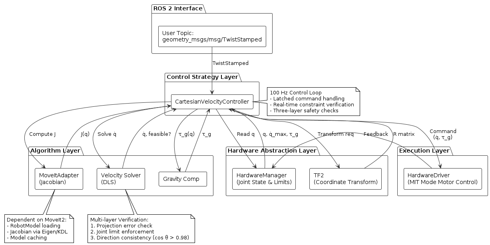

# 控制策略层子模块“笛卡尔速度控制模块”设计说明

> 本文档描述 Universal Arm Controller 系统中，算法层子模块"笛卡尔速度控制模块"的架构设计、系统集成方式与责任边界。

## 1. 功能定位与系统层角色

> 本模块属于控制策略层，其内部使用多种算法模块（雅可比、SVD、阻尼伪逆），但对系统而言是一个控制策略组件。

笛卡尔速度控制解决的核心问题是：**在末端执行器空间（6D 笛卡尔坐标系）中，将用户输入的速度指令转换为满足机械臂关节约束的关节速度命令，从而实现连续的实时速度控制**。

在系统架构中，笛卡尔速度控制属于 **控制策略层（Control Strategy Layer）** 的一个子模块。根据 [架构设计](../ARCHITECTURE.md#3-核心运行时组件) 第 3 章的描述，控制策略层的职责是：

> 在 100Hz 实时控制循环中，基于当前状态和用户指令，实现具体的控制逻辑

因此，笛卡尔速度控制在系统内的角色是：

- **为用户接口服务**：接收 ROS 2 话题上的 Twist 命令，实时转换为关节速度
- **融合多个算法模块**：使用 MoveIt2 的雅可比计算、几何变换，以及系统内的重力补偿模块
- **独立于轨迹规划**：不依赖提前计算的轨迹，而是基于实时反馈的速度解算
- **强制执行安全约束**：多层次检验确保输出的关节速度安全可行
- **实时响应用户指令**：10 ms 控制周期内完成从笛卡尔指令到关节命令的转换

---

## 2. 问题定义与数学模型

### 2.1 输入与输出

**输入**：
- 末端执行器目标速度（笛卡尔空间）：$\mathbf{v}_{\text{ee}} \in \mathbb{R}^6$
  - 线性速度：$\mathbf{v}_{\text{linear}} = (v_x, v_y, v_z) \in \mathbb{R}^3$（m/s）
  - 角速度：$\boldsymbol{\omega} = (\omega_x, \omega_y, \omega_z) \in \mathbb{R}^3$（rad/s）
- 当前关节位置：$\mathbf{q} \in \mathbb{R}^{n_{\text{dof}}}$（弧度）
- 关节速度限制：$\dot{\mathbf{q}}_{\max,j} \in \mathbb{R}^{n_{\text{dof}}}$（rad/s，各关节可不同）

**输出**：
- 关节速度命令：$\dot{\mathbf{q}} \in \mathbb{R}^{n_{\text{dof}}}$（rad/s，满足约束）

### 2.2 核心约束关系

#### 雅可比变换关系

$$\mathbf{v}_{\text{ee}} = \mathbf{J}(\mathbf{q}) \cdot \dot{\mathbf{q}}$$

其中：
- $\mathbf{J}(\mathbf{q}) \in \mathbb{R}^{6 \times n_{\text{dof}}}$ 是**雅可比矩阵**，随配置 $\mathbf{q}$ 变化
- $\mathbf{v}_{\text{ee}}$ 前 3 行对应末端线性速度，后 3 行对应角速度
- **奇异性问题**：当 $\text{rank}(\mathbf{J}) < 6$ 时，某些笛卡尔空间方向不可达

#### 关节约束

$$|\dot{q}_j| \leq \dot{q}_{\max,j}, \quad j = 1, \ldots, n_{\text{dof}}$$

各关节的速度限制独立，是 MoveIt2 URDF 配置或硬件驱动提供的参数。

#### 奇异性指标

**最小奇异值**：$\sigma_{\min} = \min_i \sigma_i(\mathbf{J})$，其中 $\sigma_i$ 是雅可比矩阵的第 $i$ 个奇异值（通过 SVD 分解得到）

用来衡量当前配置离奇异点的距离：
- $\sigma_{\min} > 0.05$：远离奇异点，全速可达
- $0.01 < \sigma_{\min} \leq 0.05$：接近奇异点，应降速
- $\sigma_{\min} \leq 0.01$：极端奇异点，必须停止

### 2.3 速度求解的不适定性

雅可比方程 $\mathbf{v}_{\text{ee}} = \mathbf{J} \cdot \dot{\mathbf{q}}$ 在以下情况下**无唯一解**：

1. **欠定**（$n_{\text{dof}} > 6$，冗余臂）
   - 多个 $\dot{\mathbf{q}}$ 能产生同一个 $\mathbf{v}_{\text{ee}}$
   - 需要额外目标函数（如最小范数、避碰等）

2. **超定**（$n_{\text{dof}} < 6$，非全向臂）
   - 某些笛卡尔方向可能无法精确达到
   - 需要投影或近似算法

3. **奇异**（$\det(\mathbf{J}) = 0$ 或 $\sigma_{\min} \approx 0$）
   - 雅可比不可逆或病态
   - 需要阻尼或其他正则化手段

> [!IMPORTANT]
> 因此，本模块的核心目标不是“精确求逆”，而是在不适定问题下寻找数值稳定、实时可执行的近似解。

---

## 3. 设计选择与算法策略

### 3.1 速度求解策略：阻尼最小二乘法（Damped Least Squares）

**核心决策**：采用**阻尼伪逆**进行关节速度求解，而非直接求逆或使用通用 QP 优化。

**为什么选择阻尼最小二乘法**：

1. **数值稳定**：阻尼项 $\lambda$ 使得矩阵 $(\mathbf{J}\mathbf{J}^T + \lambda^2 \mathbf{I})$ 总是可逆的，即使在接近奇异时
2. **实时高效**：计算复杂度为 $O(n_{\text{dof}}^3)$，单次求解在 1 ms 内完成
3. **渐进式降速**：在奇异点附近平滑降速，避免突变

**阻尼伪逆算法**：

$$\dot{\mathbf{q}} = \mathbf{J}^+ \cdot \mathbf{v}_{\text{ee}}$$

其中伪逆定义为：

$$\mathbf{J}^+ = \mathbf{J}^T (\mathbf{J}\mathbf{J}^T + \lambda^2 \mathbf{I})^{-1}$$

参数：$\lambda = 10^{-4}$（阻尼因子，可通过参数配置调整）

### 3.2 速度求解方法对比与架构选择

在选择 DLS（阻尼最小二乘法）作为速度求解器的过程中，考虑了其他主流方法。以下是关键对比：

| 求解方法 | 核心原理 | 计算复杂度 | 实时性 | 约束处理 | 适用本系统 |
|--------|--------|---------|------|--------|---------|
| **DLS（阻尼最小二乘）** | 通过阻尼项正则化伪逆，保证数值稳定 | $O(n^3)$，约 1ms | 可界定上界 | 间接（投影+多层验证） | **选中** |
| QP（二次规划） | 通过线性约束优化问题，显式处理关节限位 | 迭代求解，约 2-10ms* | 依赖收敛性 | 显式约束 | 可备选 |
| SNS（奇异值分解选择器） | 按奇异值大小删除问题方向，减少冗余度 | $O(n^2)$，约 0.5ms | 最快 | 隐式（删除方向） | 不选 |

*QP 耗时取决于求解器与初值选择，尾延迟不可严格界定，极端情况下可达5-20ms

**对比分析**：

1. **DLS vs QP**
   - **QP 优势**：能显式处理关节限位约束（关节速度限制、位置限位），优化目标明确，约束处理完整
   - **QP 劣势**：
     - 迭代求解器（QPOASES、OSQP）的收敛时间难以保证，最坏情况可能 5-20ms（取决于初值和问题难度）
     - 需要收敛性检查与超时处理逻辑，增加代码复杂性
     - 初值选择影响收敛速度，需要额外的启发式策略
   - **DLS 优势**：
     - 计算时间严格确定（矩阵求逆，< 1ms），在 10ms 周期内有充足余量（实时性有保证）
     - 通过梯度降速与多层验证实现约束，算法结构简洁
     - 不需要迭代，易于预测和调试
   - **选择原因**：在实时控制中，**确定的性能与简洁性优先于理论上的最优性**。DLS 的约束处理虽然间接，但通过多层验证机制足以保证安全

2. **DLS vs SNS**
   - **SNS 优势**：计算最快，通过删除接近奇异方向来处理奇异性
   - **SNS 劣势**：
     - 删除方向意味着完全丧失该笛卡尔方向的控制能力
     - 对用户而言不可预测（突然失去某个自由度）
     - 不适合需要精细笛卡尔控制的应用
   - **DLS 优势**：通过梯度降速平滑过渡，用户感知连续
   - **选择原因**：**平滑控制体验优于激进裁剪**

**架构判断**：选择 DLS + 梯度降速 + 多层验证，是**实时性、安全性与用户体验的最优平衡**。虽然不能显式优化全局目标，但通过：
- 确定的计算时间（< 1ms），保证不会突破 10ms 控制周期
- 梯度降速与投影验证，在数值层面保证安全
- 平滑的约束响应，提升用户操作体验

### 3.3 奇异性处理：梯度降速策略

**控制策略**：根据最小奇异值动态调整末端速度指令幅度，而不是拒绝。

**降速曲线**：

$$\alpha = \begin{cases}
1.0 & \text{if } \sigma_{\min} \geq 0.05 \\
\frac{\sigma_{\min} - 0.01}{0.05 - 0.01} & \text{if } 0.01 < \sigma_{\min} < 0.05 \\
0.0 & \text{if } \sigma_{\min} \leq 0.01
\end{cases}$$

**应用**：$\mathbf{v}_{\text{ee,scaled}} = \alpha \cdot \mathbf{v}_{\text{ee}}$

**优点**：
- 用户感知平滑，不会突然拒绝指令
- 自动调节接近奇异时的行为
- 同时保护机械臂避免奇异点陷阱

### 3.4 多层安全验证机制

系统采用**三层验证**确保输出的关节速度安全可行：

#### 第一层：投影误差检验

解出关节速度 $\dot{\mathbf{q}}$ 后，重新投影到笛卡尔空间验证：

$$\mathbf{v}_{\text{reconstructed}} = \mathbf{J}(\mathbf{q}) \cdot \dot{\mathbf{q}}$$

检验条件：

$$\|\mathbf{v}_{\text{reconstructed}} - \mathbf{v}_{\text{ee,scaled}}\|_2 < 10^{-3}$$

**目的**：捕捉数值误差和病态条件。

#### 第二层：关节约束验证

对每个关节 $j$，检验：

1. **速度限制**：
   $$|\dot{q}_j| \leq \dot{q}_{\max,j}$$

   若违反，统一缩放所有关节速度：
   $$\dot{\mathbf{q}}_{\text{scaled}} = \min_j \frac{\dot{q}_{\max,j}}{|\dot{q}_j|} \cdot \dot{\mathbf{q}}$$

2. **位置边界**：
   - 若 $q_j \leq q_{\min,j}$ 且 $\dot{q}_j < 0$，拒绝该方向
   - 若 $q_j \geq q_{\max,j}$ 且 $\dot{q}_j > 0$，拒绝该方向

#### 第三层：方向一致性检验

计算重构速度与目标速度的夹角：

$$\cos \theta = \frac{\mathbf{v}_{\text{reconstructed}} \cdot \mathbf{v}_{\text{ee,scaled}}}{\|\mathbf{v}_{\text{reconstructed}}\|_2 \cdot \|\mathbf{v}_{\text{ee,scaled}}\|_2}$$

检验条件（约 11° 容差）：

$$\cos \theta > 0.98$$

**目的**：检测因约束导致的方向严重偏离。若不满足，则拒绝本次求解。

---

## 4. 算法接口与对外契约

笛卡尔速度控制向控制器层提供的接口定义如下：

> [!NOTE]
> **输入参数**：
> - `v_linear`: 线性速度 (m/s)
> - `v_angular`: 角速度 (rad/s)
> - `frame_id`: 速度的参考坐标系（可选，默认 base_link）
> - `q_current`: 当前关节位置 (rad)
> - `q_min`, `q_max`: 关节位置限制 (rad)
> - `q_dot_max`: 关节速度限制 (rad/s)
>
> **输出结果**：
> - `q_dot`: 求解的关节速度 (rad/s)
> - `success`: 是否找到可行解（布尔值）
> - `reason`: 失败原因（可选）
>
> **不承诺的职责**：
> - 不保证速度连续性：相邻控制周期的速度指令可能因约束变化而不连续
> - 不处理碰撞检测：碰撞规避需在更高层实现
> - 不保证全局最优：仅求解局部可行的关节速度
> - 不感知控制模式：只负责笛卡尔→关节的转换

---

## 5. 系统集成与数据流

### 5.1 集成点

笛卡尔速度控制与系统各组件的交互如下：

### 5.2 关键依赖

| 依赖模块 | 功能 |
|--------|-----|
| **MoveItAdapter** | 计算雅可比矩阵 |
| **HardwareManager** | 读取关节位置、限制、重力补偿 |
| **GravityCompensationModule** | 计算重力补偿力矩 |
| **TF2** | 坐标系变换 |

### 5.3 控制循环架构

> [!IMPORTANT]
> 本模块运行在控制线程上下文中，是控制环路的硬实时参与者，禁止任何阻塞或动态内存分配。

**频率**：100 Hz（10 ms 周期）

**执行步骤**（单个控制周期）：

1. **获取最新指令**（互斥锁保护）
   - 读取 ROS 2 话题上最后一条 TwistStamped 消息

2. **超时检查**
   - 若距离上一条命令 > 100 ms，停止执行（故障安全）

3. **读取硬件状态**
   - 关节位置 $\mathbf{q}$、速度限制 $\dot{\mathbf{q}}_{\max}$

4. **坐标系转换**（如需要）
   - 若命令 frame_id ≠ base_frame，使用 TF2 转换速度向量

5. **计算雅可比矩阵**
   - 调用 MoveItAdapter→computeJacobian($\mathbf{q}$)

6. **应用奇异性降速**
   - 计算 $\sigma_{\min}(\mathbf{J})$，得到缩放因子 $\alpha$
   - $\mathbf{v}_{\text{ee,scaled}} = \alpha \cdot \mathbf{v}_{\text{ee}}$

7. **求解关节速度**
   - 调用 VelocityStrictSolver→solve()

8. **多层验证**
   - 投影误差检验、关节约束检验、方向一致性检验

9. **应用重力补偿**
   - 获取 $\tau_g(\mathbf{q})$，加到 effort 字段

10. **发送电机指令**
    - MIT 模式：position=0, velocity=$\dot{\mathbf{q}}$, effort=$\tau_g$, kp=0.0, kd=0.01

---

## 6. 性能分析

### 6.1 计算复杂度

| 操作 | 复杂度 | 单次耗时（估计） |
|-----|-------|-----------|
| 雅可比计算 | $O(n_{\text{dof}}^2)$ | 0.5-1.0 ms |
| SVD 奇异值分解 | $O(n_{\text{dof}}^3)$ | 0.2-0.5 ms |
| 阻尼伪逆求解 | $O(n_{\text{dof}}^3)$ | 0.3-0.8 ms |
| 坐标系变换 | $O(n_{\text{dof}})$ | 0.1-0.2 ms |
| **总计** | **< 3 ms** | **< 3 ms（@100Hz）** |

**结论**：总耗时远小于 10 ms 控制周期，满足 100 Hz 实时要求。

### 6.2 场景测试

#### 场景 1：正常工作空间

**初始条件**：机械臂处于工作空间中心，远离关节限制和奇异点

**期望行为**：
- 末端速度接近用户指令（偏离 < 2°）
- 关节速度在限制内
- 无降速现象

**验证方式**：
- 比较指令速度和重构速度的方向夹角
- 检查关节速度是否均匀缩放

#### 场景 2：接近关节限制

**初始条件**：某关节接近上限，用户输入方向指向限制方向

**期望行为**：
- 方向被修正，停止靠近限制
- 其他方向仍可运动
- 可能产生垂直于限制的速度分量

**验证方式**：
- 确认违反限制的方向被拒绝
- 观察是否能在其他自由度上运动

#### 场景 3：接近奇异点

**初始条件**：配置接近奇异点（$\sigma_{\min} \approx 0.02$），用户输入水平速度

**期望行为**：
- 自动降速至 20% 左右
- 速度方向保持不变
- 可以继续运动（不是完全停止）

**验证方式**：
- 监控 $\sigma_{\min}$ 和缩放因子 $\alpha$
- 比较降速前后的执行时间

#### 场景 4：坐标系转换

**初始条件**：命令以工具坐标系发送（frame_id="tool_frame"），而非 base_link

**期望行为**：
- 自动使用 TF2 查询变换
- 转换后的关节速度正确反映工具空间指令
- 无异常延迟

**验证方式**：
- 发送相同的笛卡尔指令，对比不同 frame_id 下的结果
- 验证末端实际速度是否匹配

---

## 7. 约束处理与边界条件

### 7.1 关节速度约束处理

若求解的关节速度超过限制，采用**均匀缩放**策略：

$$k = \min_j \frac{\dot{q}_{\max,j}}{|\dot{q}_j|}$$

$$\dot{\mathbf{q}}_{\text{final}} = k \cdot \dot{\mathbf{q}}$$

**特点**：
- 保持方向不变，仅改变大小
- 简单、确定性强
- 所有关节同步受约束

### 7.2 关节位置约束处理

在 workspace boundary checking 中，预测下一时刻的关节位置：

$$\mathbf{q}_{\text{next}} = \mathbf{q} + \dot{\mathbf{q}} \cdot \Delta t$$

其中 $\Delta t = 0.01$ s（控制周期）。

若 $\mathbf{q}_{\text{next}}$ 超出限制，则拒绝该方向的速度（设为 0）。

### 7.3 奇异点与运动可达性

**问题**：部分笛卡尔空间方向可能由于机械臂几何约束而不可达。

**策略**：
1. 通过投影误差检验检测到不可达
2. 记录警告日志，但不通过 topic 发布反馈，用户需通过 ROS2 logger 查看诊断信息
3. 若方向偏离超过容差，则拒绝指令并发送零速度（故障安全）

---

## 8. 责任边界与不承诺事项

### 8.1 本模块的职责

**明确承诺**：

1. **快速求解**：在 100 Hz 控制循环中，单次求解 < 3 ms
2. **安全约束**：三层验证确保输出关节速度可执行
3. **奇异性处理**：动态降速，避免进入奇异点
4. **实时性**：每个控制周期独立、无延迟地处理最新指令
5. **重力补偿**：整合 GravityCompensationModule 的结果到电机指令

### 8.2 本模块不承诺

**明确不承诺**：

1. **全局路径规划**：不生成碰撞避免的路径，仅响应实时指令
2. **平滑性保证**：每周期独立求解，可能存在速度跳跃（由于约束变化）
3. **时间最优性**：求解是局部可行的，不保证全局最优
4. **冗余度利用**：不实现避碰、零空间任务等高级优化
5. **精密定位**：速度控制无法实现高精度定位，需轨迹规划配合

### 8.3 与其他模块的职责分工

| 功能 | 本模块 | 其他模块 |
|-----|-------|--------|
| 实时速度解算 | CartesianVelocityController | - |
| 坐标系变换 | CartesianVelocityController (via TF2) | - |
| 重力补偿 | - | GravityCompensationModule |
| 碰撞检测 | - | (应用层或路径规划模块) |
| 电机驱动 | - | HardwareDriver |

---

## 9. 参考资源

- **雅可比与微分运动学**：Siciliano et al., "Robotics: Modelling, Planning and Control", Springer, Chapter 3
- **阻尼最小二乘法**：Wampler, C.W. (1986). "Manipulator Inverse Kinematics with Wrist-Partitioning by Damped Least-Squares Method", IEEE Journal of Robotics and Automation
- **奇异性处理**：Chiaverini, S. et al. (1994). "Task-Space Control of Manipulators with Joint Limits", IEEE T-RO
- **MoveIt2 雅可比计算**：https://moveit.ros.org/
- **系统架构参考**：[ARCHITECTURE.md](../ARCHITECTURE.md) - 控制策略层设计
- **相关模块**：[GRAVITY_COMPENSATION.md](GRAVITY_COMPENSATION.md) - 重力补偿算法

