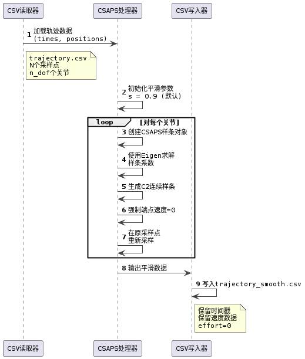
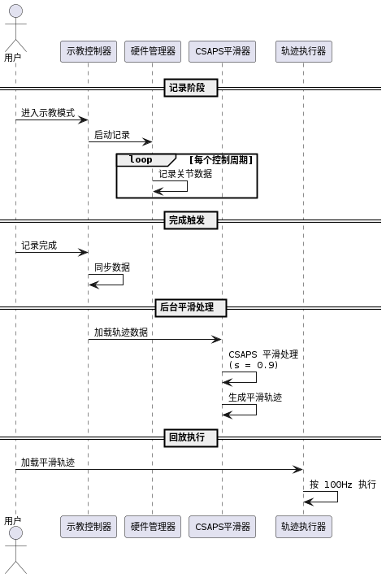

# 轨迹处理层子模块"CSAPS 平滑"设计说明

> 本文档描述 Universal Arm Controller 系统中，轨迹处理层子模块"CSAPS 平滑（Cubic Spline with Automatic Smoothing Parameter Selection）"的架构设计、系统集成方式与责任边界。

## 1. 功能定位与系统层角色

CSAPS 平滑解决的核心问题是：**对通过示教（教学编程）方式录制的关节轨迹进行平滑处理，消除示教过程中由于人为抖动和传感器噪声引入的高频成分，生成光滑可执行的轨迹**。

在系统架构中，CSAPS 属于 **轨迹处理层（Trajectory Processing Layer）** 的一个子模块。根据 [架构设计](../ARCHITECTURE.md) 第 3.4 章关于"轨迹平滑器"的定义，CSAPS 的职责是：

> 对示教录制的轨迹进行平滑处理，提高轨迹的光滑性

因此，CSAPS 在系统内的角色是：

- **示教轨迹后处理**：仅在示教（Teach）模式下对录制的轨迹进行离线平滑
- **独立于规划阶段**：不参与实时控制路径，完全离线处理
- **可选的平滑策略**：系统同时提供 CSAPS 平滑和原始数据两种选择
- **改善人工录制质量**：补偿人手操作的不规则性和传感器噪声
- **可完全替换**：若需要其他平滑算法，可直接替换该模块

### 1.1 适用范围声明

**本模块面向**："离线轨迹平滑问题，针对已录制的关节空间轨迹数据"。

**不适用于**：
- **实时控制**：示教平滑仅在录制完成后进行，不参与控制循环
- **在线动态调整**：轨迹平滑后视为固定轨迹，后续执行阶段不再修改
- **路径规划约束处理**：平滑器不进行碰撞检测或轨迹验证
- **动力学优化**：仅处理几何光滑性，不考虑扭矩或功率限制

**定位**：CSAPS 是 **示教流程的后处理阶段**，在用户确认后离线执行，用于改善录制轨迹的质量。

---

## 2. 算法模型与关键设计选择

> 本模块的设计目标是提供灵活的示教轨迹平滑能力，同时保持实现的简洁性和可维护性。

### 2.1 问题定义

给定：

- 示教录制的关节轨迹：

$$
\{\mathbf{q}_{0}, \mathbf{q}_{1}, \ldots, \mathbf{q}_{N}\}, \quad
\mathbf{q}_{i} \in \mathbb{R}^{n_{\text{dof}}}
$$

- 采样时刻：

$$
\{t_0, t_1, \ldots, t_N\} \quad \text{（通常为均匀采样，如 500 Hz）}
$$

- 采样中包含的噪声和抖动（主要来自人手操作的不规则性）

求解：

- 平滑的关节轨迹函数：

$$
\mathbf{q}_{\text{smooth}}(t)
$$

- 对应的速度曲线：

$$
\dot{\mathbf{q}}_{\text{smooth}}(t)
$$

- 对应的加速度曲线：

$$
\ddot{\mathbf{q}}_{\text{smooth}}(t)
$$

约束条件：

- **光滑性**：生成的轨迹应为 \(C^2\) 连续（位置、速度、加速度连续，在数值精度范围内）
- **保真度**：平滑后的轨迹应与原始录制数据接近，不应偏离过远
- **可执行性**：平滑后的速度和加速度应满足关节约束

### 2.2 架构级决策（Architectural Decision Record）

**决策**：采用 **自主完善的 C++ CSAPS 实现**（基于 csaps-cpp 库改进），提供 UnivariateCubicSmoothingSpline 和 MultivariateCubicSmoothingSpline，通过用户指定或默认平滑因子进行示教轨迹平滑。

**为什么选择自主完善 CSAPS-CPP**：

1. **C++ 生态一致性**：整个工程采用 C++，无需 Python 依赖，避免跨语言开销
2. **立方样条的光滑性**：提供理论上的 $C^2$ 连续性（位置、速度、加速度都连续，在数值精度范围内）
3. **多关节独立处理**：每个关节独立应用 CSAPS，支持不同关节的不同平滑特性
4. **Eigen 矩阵库支持**：直接使用 Eigen 稀疏矩阵和 SparseLU 求解器，高效可靠
5. **可配置的平滑因子**：默认值 0.9 可根据需求调整，0.0-1.0 的连续范围
6. **失败时的回退机制**：若平滑出错，自动回退到 RawSmoother（使用原始数据）
7. **端点边界条件**：系统级策略，对首末点施加零速度约束以满足轨迹安全要求

**代价与权衡**：

- **完善工作量**：csaps-cpp 作者标注为未完成版本，需自主调试和完善
- **平滑因子固定**：当前实现不自动计算最优平滑因子，使用预设的默认值或用户手工指定
- **内存开销**：存储样条系数需要额外内存（但对轨迹数据而言可忽略）
- **计算延迟**：尽管离线处理，大数据集（> 100k 点）可能有显著延迟，可配置跳过大数据集
- **关节独立处理的限制**：每个关节独立平滑意味着忽略了关节间的时间相关性

**架构判断**：该决策优先考虑 **与工程生态一致、可靠性和用户可控性**。通过采用经过完善的 C++ CSAPS 实现，避免了跨语言集成的复杂性，同时结合可配置的平滑因子和失败回退机制，系统提供了易用且鲁棒的示教轨迹平滑能力。

### 2.3 平滑算法对比

在选择 CSAPS 作为示教轨迹平滑方法时，考虑了其他主流方法。以下是关键对比：

| 方法 | 核心原理 | 参数调优 | 计算复杂度 | 连续性 | 适用本系统 |
|------|--------|--------|---------|------|---------|
| **CSAPS（立方样条）** | 分段立方多项式，可配置平滑因子 | 手工指定或默认值 | $O(N)$（带状矩阵求解），< 10ms | $C^2$ 连续（数值精度范围内） | **选中** |
| 低通滤波器（IIR/FIR） | 频域滤波，消除高频成分 | 需手工设计截止频率 | $O(N)$，极快 | $C^0$ 连续（可能有相位延迟） | 可备选 |
| 高斯平滑 | 局部加权平均，窗口内高斯加权 | 需设置方差和窗口大小 | $O(N)$，快 | $C^1$ 连续（边界处理不佳） | 可备选 |
| Savitzky-Golay 滤波 | 多项式局部拟合，保护低阶导数 | 需设置多项式阶次和窗口 | $O(N)$，快 | $C^1$ 连续（多项式阶次依赖） | 可备选 |

**对比分析**：

1. **CSAPS vs 低通滤波器**
   - **低通滤波器优势**：计算极快，实现简单
   - **低通滤波器劣势**：
     - 需要手工选择截止频率（无自动化）
     - 在轨迹开始和结束处有相位延迟和边界振荡
     - 对不同关节可能需要不同的滤波参数
   - **CSAPS 优势**：
     - 理论上 $C^2$ 连续，保证速度和加速度连续（在数值精度范围内）
     - 无相位延迟，边界处理优雅（端点速度可约束为零）
     - 多关节独立处理，支持异构关节
   - **选择原因**：**连续性与边界处理优先于计算速度**，示教平滑是离线步骤

2. **CSAPS vs 高斯平滑**
   - **高斯平滑优势**：实现简单，直观易懂
   - **高斯平滑劣势**：
     - 需手工设置多个参数（方差、窗口大小）
     - 边界处理较差（对称窗口无法应用）
     - 平滑效果对数据质量和关键点间隔敏感
   - **CSAPS 优势**：
     - 理论上 $C^2$ 连续，导数曲线在数值精度范围内光滑
     - 单一平滑因子参数，全局统一控制
     - 边界约束灵活（可强制端点速度为零）
   - **选择原因**：**参数简洁性与全局连续性优先**

3. **CSAPS vs Savitzky-Golay 滤波**
   - **Savitzky-Golay 优势**：保护低阶导数，多项式拟合稳定
   - **Savitzky-Golay 劣势**：
     - 需设置多项式阶次和窗口大小（两个参数）
     - 对于非均匀采样轨迹处理困难
     - 边界处理仍需特殊处理
     - 窗口大小对轨迹特征敏感
   - **CSAPS 优势**：
     - 支持非均匀采样（时间点可不等间距）
     - 全局样条提供理论上的 $C^2$ 连续性（数值精度范围内）
     - 单一平滑因子统一控制，更易调整
   - **选择原因**：**灵活性与全局最优性优先**

**架构判断**：选择 CSAPS，是**连续性、可控性与易用性的最优平衡**。通过：
- 理论上 $C^2$ 连续的立方样条保证速度和加速度曲线光滑（数值精度范围内）
- 端点边界条件：对首末点施加零速度约束，满足轨迹安全要求
- 单一平滑因子参数，便于用户调整
- 多关节独立处理，支持异构机械臂
- 大数据集自动跳过机制，防止计算过载

### 2.4 处理流程

---

## 3. 算法接口与对外契约

CSAPS 向轨迹管理层提供的接口定义如下：

> [!NOTE]
> **输入参数**：
> - `times`: 采样时刻序列，$\{t_0, t_1, \ldots, t_N\}$（秒，单调递增）
> - `positions`: 关节位置数据，维度 $[N+1, n_{\text{dof}}]$（弧度）
> - `velocities`: 关节速度数据，维度 $[N+1, n_{\text{dof}}]$（弧度/秒，可为零向量）
> - `efforts`: 关节加速度或力矩数据，维度 $[N+1, n_{\text{dof}}]$（可选）
> - `joint_names`: 关节名称列表，长度 $n_{\text{dof}}$
> - `smoothing_factor`: 平滑因子 $s \in (0, 1)$（默认 0.9，可配置）
>
> **输出结果**：
> - `Trajectory`: 轨迹对象，包含以下字段：
>   - `points`: 轨迹关键点序列（位置、速度、加速度、时间戳）
>   - `joint_names`: 关节名称
> - 各点的速度和加速度曲线（由 CSAPS 计算的导数）
>
> **不承诺的职责**：
> - 不验证输入轨迹的物理可行性（如关节限制、速度/加速度限制）
> - 不进行碰撞检测或路径可达性验证
> - 不处理不连续的轨迹段（如示教中的暂停/恢复）
> - 不自动选择平滑因子（使用固定默认值 0.9 或用户指定值）
> - 端点边界条件：系统级策略，对首末点施加零速度约束以满足轨迹安全要求

### 3.1 接口契约形式化

| 维度 | 约束条件 |
|------|--------|
| **输入轨迹** | 至少 3 个采样点；各关节轨迹不应包含 NaN 或 Inf |
| **采样时间** | 严格单调递增；$t_0 < t_1 < \cdots < t_N$ |
| **平滑因子** | $s \in (0, 1)$；默认值 0.9；$s$ 越接近 1 越平滑，越接近 0 越逼近原数据 |
| **输出轨迹** | 理论上 $C^2$ 连续（数值精度范围内）；仅在输入时间范围 $[t_0, t_N]$ 内有效 |
| **导数连续性** | 一阶导数（速度）和二阶导数（加速度）在所有点连续 |
| **端点速度** | 首末点速度强制为零（安全约束）；中间点使用 CSAPS 计算值 |
| **失败语义** | 若输入不合法，返回空轨迹或使用原始数据（回退到 RawSmoother） |

---

## 4. 系统内的集成位置与调用关系

### 架构分层关系

根据 [架构设计](../ARCHITECTURE.md) 第 3.4 章关于"轨迹平滑器"的定义，CSAPS 在系统中的分层位置如下：

**示教控制器的职责**：
- 记录用户的实时关节指令，生成原始轨迹数据
- 通过参数 `use_csaps` 控制是否进行平滑处理（默认关闭，需显式启用）
- 若启用 CSAPS 平滑，调用 CSAPS 模块处理轨迹；否则保留原始数据
- 将平滑后的轨迹或原始轨迹保存或提供给后续执行

**CSAPS 的职责**：
- 对记录的轨迹数据进行平滑处理
- 自动或手工调整平滑参数
- 生成光滑的速度和加速度曲线

**轨迹执行层的职责**：
- 接收平滑后的轨迹
- 执行轨迹

### 4.1 系统数据流

下图展示了 CSAPS 在示教录制、平滑处理和轨迹执行三个阶段中的完整数据流：

---

## 5. 求解策略与集成方式

> 本章描述 CSAPS 在示教流程中的具体集成方式。

### 5.1 示教流程中的 CSAPS 集成

**触发时机**：示教录制完成（用户点击"记录完成"命令），系统自动在后台线程中执行平滑处理

**执行流程**：

1. **记录阶段**
   - 用户进入示教模式，实时操作机械臂
   - 硬件管理器持续记录每个控制周期的关节位置、速度、力矩等数据
   - 数据通过观察者模式写入 CSV 文件

2. **完成触发**
   - 用户发送"记录完成"命令（complete 事件）
   - 系统立即停止记录，同步数据到磁盘
   - **启动独立后台线程**执行 CSAPS 平滑处理

3. **平滑处理阶段**（后台线程，不阻塞主线程）
   - 从 CSV 文件加载原始轨迹数据
   - 调用 CSAPS 平滑器处理每个关节
   - 生成平滑轨迹的参数表示
   - 将结果写入新的 `*_smooth.csv` 文件

4. **回放执行**
   - 用户选择回放平滑后的轨迹
   - 轨迹执行器加载 `*_smooth.csv` 数据
   - 按 500Hz 节奏执行轨迹

---

## 6. 平滑参数与调整机制

### 平滑因子的含义

平滑因子 $s \in (0, 1)$ 控制平滑程度：

- **$s \to 0$**：最大平滑，轨迹曲线最光滑（但可能偏离原始数据较远）
- **$s \to 0.5$**：中等平滑，平衡噪声滤波和数据保真
- **$s \to 1$**：最小平滑，轨迹逼近原始采样点（保留更多细节，可能保留噪声）

系统的**默认值为 0.9**（更接近原始数据），可通过平滑器接口调整平滑因子参数。

### 手工调整指南

对于特定应用，用户可根据需要调整平滑因子：

| 场景 | 建议操作 | 调整幅度 |
|------|--------|--------|
| 轨迹仍有明显抖动 | 减小 $s$（更平滑） | $s = 0.9 \to 0.85$ |
| 轨迹偏离原始数据过远 | 增大 $s$（更接近原始） | $s = 0.9 \to 0.95$ |
| 平滑后轨迹在特定关节有振荡 | 为该关节单独调整或回退到原始数据 | 考虑使用 RawSmoother |
| 轨迹数据质量很低（大量抖动） | 最大化平滑 | $s = 0.95-0.6$ |

### 大数据集处理

系统提供 **大数据集自动跳过机制**：

- **阈值**：默认 100,000 个采样点
- **行为**：超过阈值时自动回退到 RawSmoother（使用原始数据）
- **原因**：避免长时间计算延迟影响用户体验
- **调整**：通过 `set_large_dataset_threshold()` 修改阈值

---

## 7. 实时性能与调度约束

### 计算性能

- **单轨迹平滑耗时**：$O(N)$，其中 $N$ 为采样点数
- **典型耗时**：< 10ms（对于 1000 个采样点）
- **内存占用**：$O(N \cdot n_{\text{dof}})$（存储样条系数）

### 非硬实时保证

系统运行在标准 Linux + ROS 2 环境，**不提供硬实时保证**：

- 无法保证计算延迟 < 1μs 级别
- **关键调度语义**：
  - 轨迹**记录阶段**：实时运行在 500Hz 控制循环（通过硬件管理器持续观察电机状态）
  - 轨迹**平滑阶段**：记录完毕后在独立的后台线程中离线执行（不占用控制循环）
  - 轨迹**回放执行**：加载平滑后的数据，在执行线程中按 500Hz 节奏执行

**集成者责任**：CSAPS 是示教流程的后处理阶段，在用户点击"记录完成"（complete）后自动触发后台平滑处理，不影响实时控制和轨迹回放。

---

## 8. 集成边界与责任划分

### CSAPS 模块不负责的事项

- 不验证输入数据的合法性（如 NaN、Inf）
- 不进行约束检查（速度、加速度、关节限制）
- 不处理不连续的轨迹段
- 不对平滑结果进行后处理或验证
- 不生成执行时间或轨迹参数

### 示教控制器必须负责的事项

- 提供干净的原始轨迹数据（预处理异常值）
- 呈现平滑参数选项给用户
- 处理平滑失败情况（使用原始数据或提示用户）
- 对平滑结果进行验证（可选，如可视化对比）
- 决定是否保存平滑后的轨迹

### 轨迹执行层的职责

- 接收平滑轨迹（或从存储加载）
- 进行约束检查和可行性验证
- 执行轨迹或转化为执行格式

---

## 9. 运行语义与系统级行为保证

CSAPS 的实现应满足以下典型场景的行为预期：

### 场景 1：标准示教平滑

**初始条件**：用户完成示教，确认轨迹质量中等（有轻微抖动）

**期望行为**：
- 使用默认平滑因子 0.9（或用户指定值）
- 生成光滑轨迹，抖动明显减少
- 生成的速度和加速度曲线连续光滑
- 平滑后轨迹与原始轨迹偏差 < 5%（或可配置阈值）

**验证方式**：
- 可视化对比原始和平滑轨迹
- 检查速度和加速度曲线的连续性
- 验证轨迹是否通过约束检查

### 场景 2：高质量示教（低噪声）

**初始条件**：用户操作平稳，录制的轨迹已经较光滑

**期望行为**：
- 使用默认平滑因子 0.9（接近原始数据）
- 输出轨迹与原始轨迹接近一致
- 平滑作用最小化，仅轻微滤波

**验证方式**：
- 确认使用的平滑因子值为 0.9
- 检查输出与输入的偏差 < 1%

### 场景 3：大数据集自动跳过

**初始条件**：用户录制了超长轨迹（> 100,000 个采样点）

**期望行为**：
- 系统自动检测数据量超过阈值
- 跳过 CSAPS 平滑处理，直接回退到 RawSmoother
- 使用原始数据作为输出，避免长时间计算
- 用户收到日志提示

**验证方式**：
- 检查日志输出是否提及"跳过平滑"
- 确认输出轨迹与输入相同（无变化）

---

## 10. 典型使用语义

### 选择是否使用 CSAPS

系统默认不进行平滑处理，通过参数 `use_csaps` 显式控制：

**使用模式**：

1. **`use_csaps = false`（默认）**：直接使用原始轨迹数据，无平滑处理
   - 适用：已优化的轨迹，或轨迹质量已足够好
   - 优势：无额外计算开销，保留原始特征

2. **`use_csaps = true`**：启用 CSAPS 平滑处理
   - 适用：人工示教录制的轨迹，有轻微抖动和噪声
   - 优势：生成光滑的速度和加速度曲线，改善轨迹质量

**建议准则**：
- 示教通常建议设置 `use_csaps = true`，以改善录制质量
- 优化后或批量生成的轨迹可保持默认 `use_csaps = false`
- 若轨迹过大（> 100k 点），系统自动回退到原始数据

---

## 参考资源

- **CSAPS 理论基础**：Reinsch, C.H. (1967). "Smoothing by spline functions". Numerische Mathematik
- **立方样条理论**：de Boor, C. (1978). "A Practical Guide to Splines". Springer-Verlag
- **smoothing spline 的统计理论基础**：Wahba, G. (1990)
Spline Models for Observational Data
- **CSAPS Python 原始库**：https://github.com/espdev/csaps （Python 参考实现）
- **Eigen 稀疏矩阵求解**：https://eigen.tuxfamily.org/ (SparseLU factorization)
- **系统架构参考**：[ARCHITECTURE.md](../ARCHITECTURE.md) 第 3.4 章 - 轨迹平滑器

