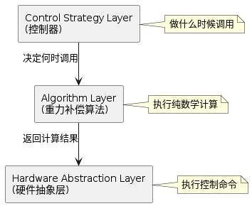

# 重力补偿算法设计说明

> 本文档描述 Universal Arm Controller 系统中，算法层子模块“重力补偿模块”的架构设计、系统集成方式与责任边界。

## 1. 功能定位与系统层角色

重力补偿解决的核心问题是：**在 MIT 模式控制下，机械臂各关节需要实时补偿由重力产生的力矩，使得机械臂能够在任意姿态下保持稳定**，而不需要持续的关节驱动指令。

在系统架构中，重力补偿属于 **算法层（Algorithm Layer）** 的一个子模块。根据 [架构设计](../ARCHITECTURE.md#3-核心运行时组件) 第 3 章的描述，算法层的职责是：

> 提供纯数学计算能力（无业务逻辑）

因此，重力补偿在系统内的角色是：

- **为控制策略层（Control Strategy）服务**：提供关节重力力矩的计算接口
- **独立于控制模式**：不感知具体是轨迹执行、速度控制还是示教模式
- **独立于硬件实现**：不关心电机驱动协议或总线类型，仅提供纯数学结果
- **可完全替换**：若需要使用其他动力学引擎或简化模型，可以直接替换该模块而不影响控制器逻辑

---

## 2. 算法模型与关键设计选择

> 本模块的设计目标是在保证 100Hz 实时性的前提下，为多控制模式提供可复用、可替换的重力补偿能力。

### 2.1 动力学模型范围

重力补偿计算的是**仅包含重力项的力矩补偿**：

$$\tau_g(q) = g(q)$$

其中：
- $q$ 为关节位置向量（弧度）
- $\tau_g$ 为各关节的重力力矩向量

这意味着系统**不计算科氏力、离心力等动态项**，仅补偿静态重力效应。这个选择使得：

- 计算复杂度低（O(n)），适合 100Hz 实时控制
- 对模型参数变化（如负载）的鲁棒性相对较好（只需关心质量分布）
- 高速运动时存在科氏力和离心力误差

### 2.2 设计选择：采用 Pinocchio 库而非自实现

**核心决策**：使用 Pinocchio（开源机器人动力学库）作为底层计算引擎，而不是自实现动力学算法。

**为什么选择 Pinocchio**：

1. **成熟与可靠性**：Pinocchio 是业界标准库，被广泛应用于学术和工业机器人领域
2. **算法高效**：使用经过优化的递推牛顿-欧拉（RNEA）算法，复杂度为 O(n)
3. **模型灵活性**：直接支持 URDF 格式的机械臂模型，适配不同的硬件配置
4. **维护与扩展**：无需维护自定义的动力学引擎，长期可维护性更强

**代价与权衡**：

- 增加了外部依赖（需要编译和安装 Pinocchio）
- 模型加载需要正确的 URDF 文件和配置路径
- 初始化时需要一次性的模型解析（后续调用速度快）

---

## 3. 算法接口与对外契约

重力补偿向控制策略层提供的接口定义如下：

> [!NOTE]
> **输入参数**：
> - `q`: 关节位置向量（单位：弧度）
> - `mapping`: 映射标识符（用于多臂系统中区分不同的臂）
>
> **输出结果**：
> - `τ_g`: 重力补偿力矩向量（单位：Nm，与关节配置对应）
>
> **不承诺的职责**：
> - 不关心是哪个控制模式在调用（轨迹、速度、示教等都可用）
> - 不感知 ROS 2 的存在
> - 不访问硬件驱动或执行层
> - 不包含任何状态机或业务决策逻辑

这种设计保证了**算法层的纯粹性**：它就是一个数学计算模块，接收输入，返回计算结果。

---

## 4. 系统内的集成位置与调用关系

### 架构分层关系

根据 [架构设计](../ARCHITECTURE.md#63-控制器--算法层-的边界计算边界) 第 6.3 章关于"控制器 ↔ 算法层边界"的定义，重力补偿在系统中的分层位置如下：

**控制器的职责**：
- 决定何时触发重力补偿计算（轨迹执行时预计算，速度控制和轨迹记录时实时计算）
- 组织算法的输入参数（当前关节位置）
- 解释算法的输出（力矩向量）
- 将力矩结果转化为 MIT 模式的控制命令发送给硬件

**算法的职责**：
- 执行纯数学运算，基于 URDF 模型和关节位置计算重力力矩
- 不做任何关于控制策略的决策

---

## 5. 双层集成策略

重力补偿在系统中有**两种不同的集成模式**，分别对应不同的性能权衡：

### 5.1 轨迹执行：离线预计算策略

**触发时机**：轨迹执行命令被调用时（HardwareManager::execute_trajectory_async()）

**执行方式**：
- 当轨迹执行命令到达时，遍历整条轨迹的所有路径点
- 对每个路径点的关节位置计算一次重力力矩（使用 Pinocchio RNEA 算法）
- 将计算结果存储在硬件驱动层 TrajectoryPoint 的 `efforts` 字段中
- 随后在轨迹执行 worker 线程中，每个控制周期直接使用预计算的力矩值

**优点**：
- 执行期间零计算开销（直接使用预存的力矩值）
- 可以在轨迹规划完成后离线计算，不占用实时控制周期
- 轨迹执行速度恒定（100Hz），力矩值直接映射

**代价**：
- 需要额外内存存储轨迹中每个点的力矩数据
- 如果轨迹很长，预计算时间可能较长（但仅在启动时发生）

### 5.2 速度/示教：实时计算策略

**触发时机**：每个控制周期（100Hz 定时器，即每 10ms）

**执行方式**：
- 在速度控制器或示教控制器的主控制循环中，每个周期都调用重力补偿计算
- 使用当前的关节位置（从硬件反馈获得）进行计算
- 将结果直接用作该周期的 MIT 命令的力矩分量

**优点**：
- ✅ 无需预存数据，内存占用少
- ✅ 跟踪实时的关节位置变化，适应外部干扰或位置偏差

**代价**：
- 每个控制周期需要执行一次 O(n) 的计算
- 在 100Hz 下仍在可接受范围（典型硬件上 < 1ms）

### 权衡总结

| 指标 | 轨迹执行（预计算） | 速度/示教（实时） |
|------|------------------|-----------------|
| 实时计算开销 | 零 | 每周期 O(n) |
| 内存占用 | 高（按轨迹长度） | 低 |
| 自适应性 | 固定预存值 | 跟踪实时位置 |
| 适用场景 | 精准轨迹执行 | 交互式控制 |

---

## 6. 实时性能与调度约束

### 计算复杂度

- **时间复杂度**：O(n)，其中 n 为关节数（通常为 6）
- **空间复杂度**：O(n)，主要用于存储中间计算结果

### 性能预期

基于目标硬件（标准 x86 或 ARM 多核处理器）：

- 单次计算耗时：**< 1ms**
- 在 100Hz 控制周期（10ms）内的占比：**< 10%**
- 不会成为控制循环的瓶颈

### 非硬实时保证

系统运行在标准 Linux + ROS 2 环境，**不提供硬实时保证**：

- 无法保证计算延迟 < 1μs 级别
- 无法保证任意时刻的计算时间确定性
- 在 100Hz 控制周期下保证统计上的确定性调度

**集成者责任**：如果应用需要硬实时保证（如重型工业臂焊接），需在系统外层添加 RTOS 或边界硬实时层。

---

## 7. 集成边界与责任划分

### 算法模块不负责的事项

- 不处理 URDF 模型的加载失败恢复（由 HardwareManager 负责）
- 不验证输入关节位置的合法性（由控制器负责边界检查）
- 不处理并发访问的同步（由 HardwareManager 的 mutex 保护）
- 不知道计算结果如何被使用

### 控制策略层必须负责的事项

- 在调用前确保关节位置在有效范围内
- 处理算法返回的异常值（如模型未加载时的零向量）
- 决定何时进行计算（轨迹启动 vs 每周期实时）
- 在数据不一致时（如切换控制模式）的逻辑处理

### 硬件抽象层的职责

- 负责 Pinocchio 模型的加载和初始化
- 负责 URDF 文件路径的管理
- 提供线程安全的计算接口（mutex 保护）
- 缓存已加载的模型，避免重复初始化

---

## 8. 典型使用语义与验证期望

重力补偿的实现应满足以下典型场景的行为预期：

### 场景 1：零速度悬停

**期望行为**：当用户在速度控制模式下发送零速度命令时，机械臂应该在当前位置保持静止，不会缓慢下坠。

**工作机制**：
- 速度控制器每个周期计算当前位置的重力力矩
- 将重力力矩作为 MIT 命令的 effort 分量发送
- 由于无外部扰动，关节能够平衡重力

### 场景 2：平衡的起升

**期望行为**：机械臂关节即使在重力作用下仍能以相对较小的速度命令实现上升运动。

**工作机制**：
- 重力补偿抵消了关节的重力力矩
- 用户的速度命令可以直接驱动关节运动（不需要额外的速度开销来克服重力）

### 场景 3：轨迹到位保持

**期望行为**：轨迹执行完成后，机械臂到达目标位置，并在没有额外驱动的情况下保持该位置。

**工作机制**：
- 轨迹执行时预计算了目标位置的重力力矩
- 轨迹结束时，硬件执行最后一个点的力矩命令，关节稳定在目标位置

---

## 参考资源

- **Pinocchio 官方文档**：https://github.com/stack-of-tasks/pinocchio
- **RNEA 算法原理**：Featherstone, R. "Rigid Body Dynamics Algorithms"
- **系统架构参考**：[ARCHITECTURE.md](../ARCHITECTURE.md#63-控制器--算法层-的边界计算边界) 第 6.3 章 - 控制器 ↔ 算法层边界

