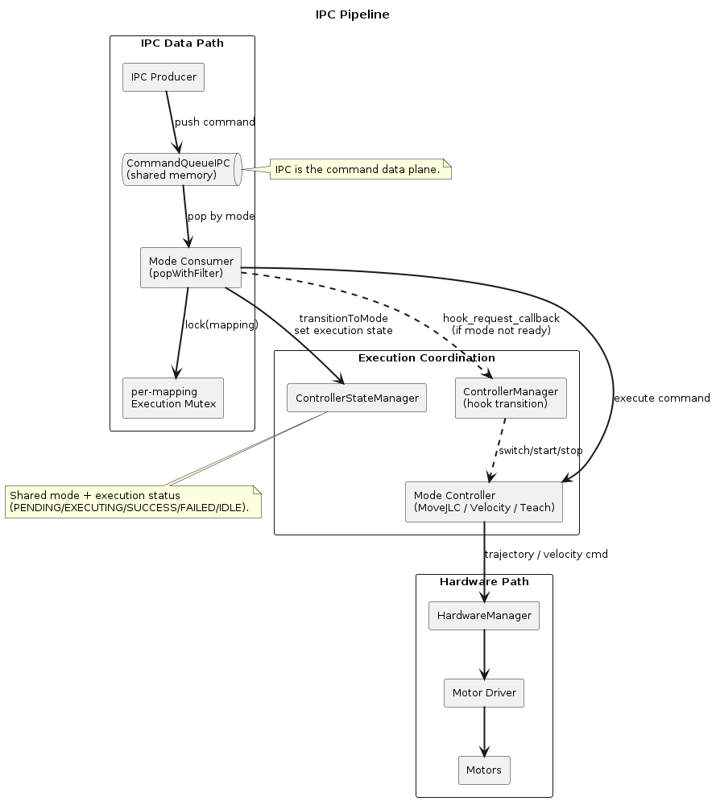
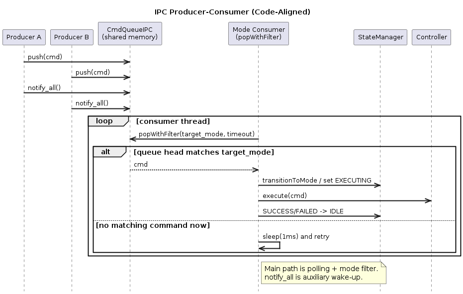
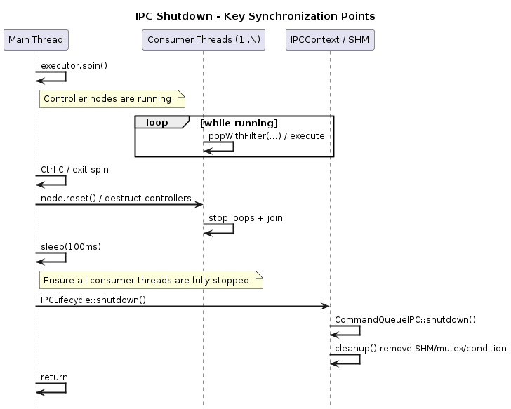
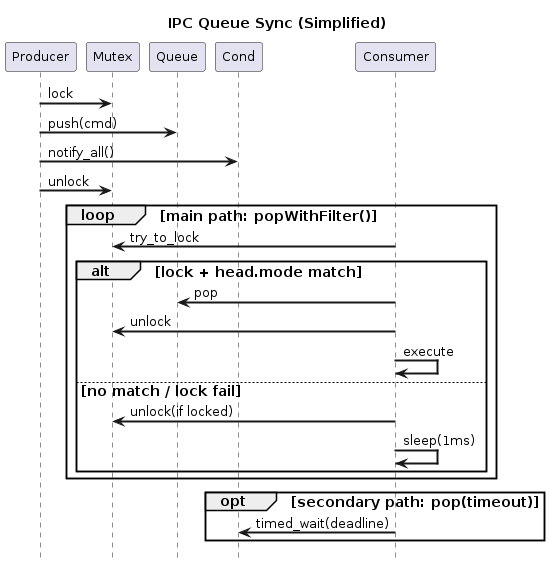
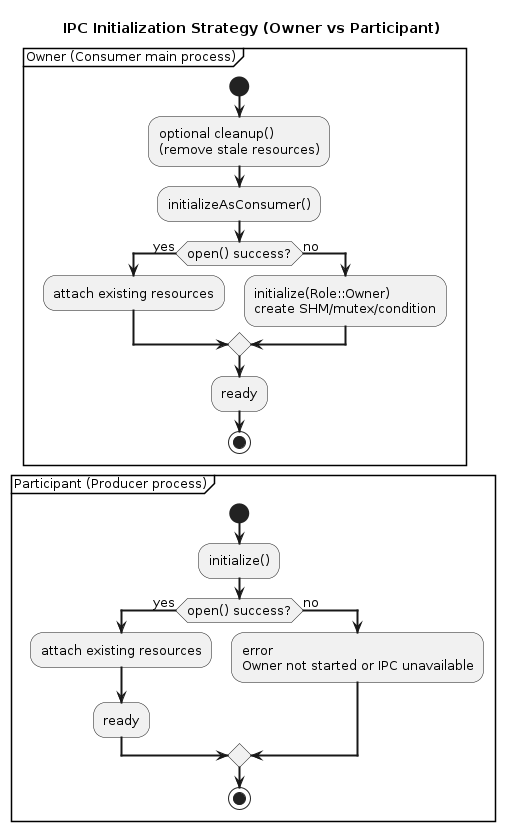

# 进程间通信（IPC）机制设计说明

> 本文档描述 Universal Arm Controller 系统中，进程间通信（IPC）模块的架构设计、生命周期管理与跨进程协调机制。

## 1. 功能定位与系统角色

### 1.1 核心问题

Universal Arm Controller 的多控制模式与多进程接入需求带来一个核心架构问题：

> **如何让多个外部进程（如用户应用、遥控程序、OpenClaw 插件）与控制进程安全交互，同时不阻塞 ROS 2 控制线程，并满足 100Hz 软实时控制目标？**

IPC 机制的设计目标：
- **软实时目标**：ROS 2 多线程执行器的控制循环不被外部进程调用阻塞，维持 100Hz 控制节奏
- **进程隔离**：外部进程的崩溃不直接影响实时控制器
- **异步通信**：命令生产者（外部进程）与命令消费者线程（各 mode consumer）异步操作
- **安全共享**：多个生产者同时推送命令，消费者安全消费，无竞态条件

### 1.2 在系统架构中的位置

IPC 机制位于 **系统接口层（System Interface Layer）**。  
在当前实现中，IPC 的主职责是作为**命令数据平面**：外部进程将命令写入共享内存队列，由各控制模式的 consumer 线程按 `popWithFilter(mode)` 消费并驱动控制器执行。  

ROS 侧接口主要承担模式管理与状态发布，不是 IPC 命令到电机执行的主数据通路。

IPC 侧的数据链路如下：

<p align="center">
  
</p>

---

## 2. 架构设计

### 2.1 跨进程生产者-消费者模式

IPC 在本项目中承担**命令数据平面**：  
生产者进程只负责写入命令，控制进程中的各模式 consumer 线程按 mode 过滤消费并执行。

<p align="center">
  
</p>


**关键特征**：
- **异步提交**：生产者 `push()` 后立即返回，不等待命令执行结果。
- **多生产者并发**：多个外部进程可并发写入，通过命名互斥锁串行化队列写入。
- **多消费者线程**：控制进程内每个模式有独立 consumer，通过 `popWithFilter(mode)` 消费。
- **严格队头过滤**：仅当队头命令 mode 匹配目标 mode 才会弹出，保持全局 FIFO 顺序语义。
- **轮询优先，唤醒辅助**：主路径以短周期轮询（含 `try_to_lock`）为主，`notify_all()` 用于加速唤醒，不是唯一驱动机制。
- **可中断退出**：依赖 `shutdown` 标志和短轮询周期，保证退出/切换时响应及时。

### 2.2 Role-Based 权限模型（Owner / Participant）

共享内存资源（SHM、named_mutex、named_condition）采用角色化权限，避免“谁能创建/删除资源”的竞态。

#### Owner（控制进程）
- **身份**：主控制进程（`main.cpp` 所在进程）
- **权限**：
  - 可创建资源（`initialize(Role::Owner)`）
  - 可删除资源（`cleanup()`）
- **职责**：
  - 启动时负责准备可用 IPC 资源（先尝试 `open`，失败则创建）
  - 关闭时负责最终系统资源清理（删除命名资源）

#### Participant（外部生产者进程）
- **身份**：外部命令发送进程
- **权限**：
  - 仅可 `open()` 已存在资源
  - 不允许 `initialize(Role::Owner)` 创建资源
  - 不允许 `cleanup()` 删除资源
- **职责**：
  - 依赖 Owner 先启动
  - 仅负责命令入队，不参与资源生命周期管理

### 2.3 共享资源生命周期（两阶段）

#### 阶段一：本地引用释放（`close()` / `reset()`）
只释放当前进程中的对象引用（如 `segment_`、`queue_`、`mutex_`、`condition_`）。  
**不会**删除系统命名资源。

#### 阶段二：系统资源删除（`cleanup()`）
Owner 调用 Boost.Interprocess `remove()` 删除命名资源：
- `shared_memory_object::remove(SHM_NAME)`
- `named_mutex::remove(MUTEX_NAME)`
- `named_condition::remove(COND_NAME)`

删除后，系统回到“可干净重建”状态。

**结论**：
- `close/reset` 解决“进程内引用释放”
- `cleanup/remove` 解决“系统级资源回收”
- 两者职责不同，不能互相替代

---

## 3. 关闭顺序的重要性

### 3.1 为什么顺序很关键

多线程实时系统中，IPC 资源被多个线程使用。关闭顺序错误导致的常见问题：

**错误顺序**：
```
1. executor.spin() ──► 消费线程运行中...
2. IPCContext::shutdown() ──► 删除 SHM
3. 节点析构... ──► 消费线程尝试访问已删除 SHM
                    ↓ SIGSEGV 段错误
```

**正确顺序**：
```
1. executor.spin() ──► 消费线程运行中...
2. 节点析构 ──► 消费线程逐个 join() 并停止
3. sleep(100ms) ──► 确保所有线程完全退出
4. IPCContext::shutdown() ──► 安全删除 SHM
   （无线程再访问资源）
```

### 3.2 关键的同步点

<p align="center">
  
</p>
---

## 4. 多生产者的并发安全性

### 4.1 命令队列的线程安全设计

<p align="center">
  
</p>

**同步机制**：
1. **Mutex（命名互斥锁）**：序列化对队列的访问，防止 push/pop 时的数据竞争
2. **Condition Variable**：
   - Producer push 后 `notify_all()`
   - 通用 `pop()` 支持 `timed_wait`；主控制路径（`popWithFilter`）以 1ms 轮询为主

补充说明：`popWithFilter` 还包含“队头 mode 过滤（head.mode == target_mode）”与 `try_to_lock` 机制，
因此在多模式并发消费时可以保持全局 FIFO 语义并降低 shutdown 期间死锁风险。

### 4.2 避免死锁的设计

在关闭过程中，由于 Owner 会删除 mutex/condition，必须特别小心：

**风险**：
- Consumer 可能在尝试获取已被删除的 mutex
- Mutex 在关闭时可能被 cleanup 线程删除，导致未来的 lock() 失败

**解决方案**：
1. Consumer 采用 **try_to_lock**（非阻塞）而非阻塞 lock
2. Consumer 每次轮询迭代都重新检查 SHM 有效性
3. Owner shutdown() 前，先设置 shutdown flag，让消费线程主动退出
4. 等待 100ms 确保所有消费线程已释放所有锁

---

## 5. 初始化策略

### 5.1 第一次启动 vs 恢复启动

IPC 资源初始化遵循 Owner/Participant 分离策略：
<p align="center">
  
</p>

**header 的作用**：
- 版本号检验：通过 `version` 字段检查生产者/消费者协议版本是否匹配
- 基础有效性校验：通过 `magic`（0xDEADBEEF）+ `version` 判定 SHM Header 是否可用
- segment 元信息：记录共享内存段大小（`segment_size`）等基础信息

### 5.2 为什么不自动创建

Participant（Producer）**禁止创建资源**（即禁止走 `initialize(Role::Owner)` 创建路径），即使资源不存在：

**原因**：
1. **多进程竞态**：多个 Producer 同时启动时，不知道谁应该创建
2. **所有权混乱**：如果 Producer 创建了资源，Owner 关闭时删除，Producer 仍在使用 ──► SIGSEGV
3. **清晰的依赖关系**：Producer 应该依赖 Owner，而不是独立存在

---

## 6. 故障恢复机制

### 6.1 不完整关闭的恢复

场景：前次关闭异常，命名资源残留或不一致

**清理步骤**（Owner 初始化时自动执行）：
1. 尝试 remove(SHM_NAME) - 清理旧的 SHM
2. 尝试 remove(MUTEX_NAME) - 清理旧的互斥锁
3. 尝试 remove(COND_NAME) - 清理旧的条件变量
4. create_only() 创建新的、干净的资源

这确保了即使前次 cleanup() 不完整，Owner 启动时也能"自愈"。

### 6.2 Producer 应对资源不存在

```
场景：Owner 未启动

Producer 的行为：
  ├─ open() 失败
  ├─ 报错："Shared memory not found"
  ├─ 等待用户启动 Owner
  └─ （可选）定期重试
```

Producer **不应该**尝试创建资源。这是一个**设计约束**，用来强制依赖关系。

---

## 7. 性能考虑

### 7.1 轮询 vs 阻塞等待

当前实现同时存在两种等待策略，但**主控制路径**是 `popWithFilter`：

- **主路径（控制器 consumer）**：`popWithFilter(mode)` + 1ms 轮询 + `try_to_lock`
- 响应时间：最多 1ms（相对于 Ctrl-C）
- CPU 占用：与 consumer 数量和命令密度相关，通常可接受
- 死锁风险：极低（非阻塞）

- **次路径（通用队列接口）**：`pop(timeout)` 支持 `timed_wait`，用于非主路径场景。

### 7.2 命令队列大小

当前设计使用共享内存中的 **deque**（双端队列）存储命令副本：


> [!NOTE]
> 队列结构：
> 
> [cmd0] [cmd1] [cmd2] ... [cmdN]  (受共享内存总容量约束)


**权衡**：
- 队列无显式固定上限，极端突发流量会增长并占用更多 SHM 内存
- 依赖上层命令发送节流、模式过滤消费、以及进程生命周期管理来控制积压风险

---

## 8. 监控与诊断

### 8.1 资源泄漏的诊断

```bash
# 查看 Boost.Interprocess 命名资源
ls -lh /dev/shm | grep -E "arm_controller_shm_v1|arm_controller_mutex|arm_controller_cond"

# 正常：控制进程退出后上述资源应被 Owner cleanup 删除
# 异常：进程已退出但资源仍残留，通常表示异常退出或清理中断
```

### 8.2 死锁的诊断

```bash
# 查看进程状态
ps aux | grep arm_controller

# 状态标记：
# S ──► 可中断睡眠（正常）
# D ──► 不可中断睡眠（可能死锁）
# Z ──► 僵尸进程（清理失败）
```

---

## 9. 相关文件与代码组织

| 组件 | 文件 | 职责 |
|------|------|------|
| SharedMemoryManager | `src/arm_controller/include/arm_controller/ipc/shm_manager.hpp` + `src/arm_controller/src/ipc/shm_manager.cpp` | 直接操作 Boost.Interprocess，管理 SHM/mutex/cond |
| IPCContext | `src/arm_controller/include/arm_controller/ipc/ipc_context.hpp` + `src/arm_controller/src/ipc/ipc_context.cpp` | 高级接口，负责初始化策略和生命周期 |
| CommandQueueIPC | `src/arm_controller/include/arm_controller/ipc/command_queue_ipc.hpp` | 队列操作接口（push/pop/popWithFilter），消费者逻辑 |
| CommandProducer | `src/arm_controller/include/arm_controller/ipc/command_producer.hpp` + `src/arm_controller/src/ipc/command_producer.cpp` | 生产者端的命令构建和推送接口 |
| TrajectoryCommand | `src/arm_controller/include/arm_controller/ipc/ipc_types.hpp` | 命令的数据结构定义 |

> [!NOTE]
> 当前控制进程的消费模型是“多 consumer 线程 + mode 过滤消费”，常见入口包括：
> `movej/movel/movec/joint_velocity/cartesian_velocity/trajectory_record/trajectory_replay` 的 `command_queue_consumer_thread()`。

---

## 10. 最后的设计原则

1. **明确的所有权**：Owner/Participant 角色必须严格区分，无例外
2. **两阶段清理**：close() 清理指针，cleanup() 删除系统资源，缺一不可
3. **关闭顺序**：线程 → 资源，绝不反向
4. **防守式设计**：消费者假设 SHM 可能在任何时刻被删除，每轮都重新检查
5. **多消费者 + 过滤消费**：按 mode 过滤并保持队列全局顺序
6. **多生产者序列化**：通过 mutex 将并行的 push 操作序列化

遵循这些原则，跨进程 IPC 可以做到既安全又高效。
