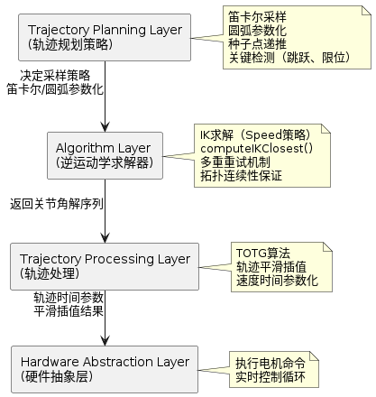

# 时间最优轨迹生成算法设计说明

> 本文档描述 Universal Arm Controller 系统中，轨迹处理层子模块"时间最优轨迹生成（TOTG）模块"的架构设计、系统集成方式与责任边界。

## 1. 功能定位与系统层角色

时间最优轨迹生成解决的核心问题是：**在给定关节空间路径和运动学约束的前提下，为轨迹计算平滑的速度和时间参数，使得轨迹在尊重所有约束条件下以最少时间完成**。

在系统架构中，TOTG 属于 **轨迹处理层（Trajectory Processing Layer）** 的一个关键子模块。根据 [架构设计](../ARCHITECTURE.md) 第 6.3 章关于"轨迹处理"的定义，TOTG 的职责是：

> 在规划层生成的关节空间路径上，计算时间参数和速度曲线

因此，TOTG 在系统内的角色是：

- **为轨迹规划提供时间参数化**：MoveL/MoveC 生成的路径点序列本身无时间信息，TOTG 添加速度和时间戳
- **保证关节约束**：尊重所有关节的速度限制和加速度限制，防止硬件超负荷
- **优化执行时间**：在满足约束的前提下最小化总轨迹时间
- **独立于规划策略**：不感知规划是 MoveL、MoveC 还是其他策略，仅处理已规划的路径点
- **可完全替换**：若需要使用其他时间参数化算法，可直接替换该模块

### 1.1 适用范围声明

**本模块面向**："已给定离散路径点序列的离线时间参数化问题"。

**不适用于**：
- **在线重规划**：若路径在执行过程中动态变化，需在更高层处理轨迹切换
- **带动力学约束的最优控制**：仅处理运动学约束（速度、加速度），不考虑扭矩、功率等动力学因素
- **含碰撞约束的参数化**：碰撞避免应在路径规划阶段完成，TOTG 不参与碰撞检测

**定位**：TOTG 是 **路径后处理阶段的时间参数化器**，在规划线程中离线执行，将几何路径转换为可执行的时间参数轨迹。

---

## 2. 算法模型与关键设计选择

> 本模块的设计目标是在保证实时性的前提下，为轨迹执行提供可靠的速度曲线。

### 2.1 问题定义

给定：
- 关节空间路径： $\mathbf{q}_0, \mathbf{q}_1, \ldots, \mathbf{q}_N$ ，其中 $\mathbf{q}_i \in \mathbb{R}^{n_{dof}}$ （N+1 个关键点，每个点包含 $n_{dof}$ 个关节）
- 关节速度限制： $v_{\max,j}$ 对每个关节 $j = 1, \ldots, n_{dof}$（各关节可不同）
- 关节加速度限制： $a_{\max,j}$ 对每个关节 $j = 1, \ldots, n_{dof}$（各关节可不同）
- 速度缩放因子： $\alpha_v \in (0, 1]$（全局缩放，表示使用最大速度的百分比）
- 加速度缩放因子： $\alpha_a \in (0, 1]$（全局缩放，表示使用最大加速度的百分比）

求解：
- 轨迹持续时间 $T$（最小化）
- 沿路径的时间参数函数 $s(t)$（从 0 到 1，归一化路径坐标）
- 每个关键点的速度 $\dot{\mathbf{q}}_i \in \mathbb{R}^{n_{dof}}$ 和加速度 $\ddot{\mathbf{q}}_i \in \mathbb{R}^{n_{dof}}$

约束条件（对每个关节 $j$ 独立）： 

$$|\dot{\mathbf{q}}_{i,j}(t)| \leq \alpha_v \cdot v_{\max,j}, \quad \forall j = 1, \ldots, n_{dof}$$
$$|\ddot{\mathbf{q}}_{i,j}(t)| \leq \alpha_a \cdot a_{\max,j}, \quad \forall j = 1, \ldots, n_{dof}$$

端点条件（硬约束）： 

$$\dot{\mathbf{q}}(0) = 0, \quad \dot{\mathbf{q}}(T) = 0$$

### 2.2 架构级决策（Architectural Decision Record）

**决策**：采用 MoveIt2 框架中的 `TimeOptimalTrajectoryGeneration` 算法，而不自研轨迹参数化实现。

**为什么选择 MoveIt TOTG**：

1. **算法成熟**：系统中使用的 Time-Optimal Trajectory Generation（TOTG）算法基于 Kunz 与 Stilman 在 Robotics: Science and Systems 会议上提出的 ‘Time-optimal trajectory generation for path following with bounded acceleration and velocity’ 方法，该方法用于将几何路径转换为满足速度和加速度约束的时间最优轨迹，后来被 MoveIt 所采用作为默认时间参数化器之一。
2. **约束支持完整**：同时处理速度、加速度、路径曲率等多重约束
3. **端点控制**：保证轨迹起点和终点速度为零（安全性关键）
4. **可靠的集成**：MoveIt 社区持续维护，避免维护负担
5. **缩放灵活性**：支持速度和加速度缩放，便于运行时调整

**代价与权衡**：

- 增加对 MoveIt2 的依赖（但系统已使用 MoveIt2 进行正运动学计算）
- 算法时间复杂度 $O(N)$（与路径点数成正比）
- 对某些病态路径（如高曲率区域）可能耗时较长（但仍在可接受范围内）

**架构判断**：该决策优先考虑 **工程可靠性与长期可维护性**，而非算法创新性。通过采用 MoveIt 社区维护的成熟算法，系统避免了自研参数化的维护负担，换取对业界标准的依赖和长期支持。

### 2.3 时间参数化方法对比

在选择 MoveIt TOTG 算法的过程中，考虑了其他主流的时间参数化方法。以下是关键对比：

| 方法 | 核心原理 | 算法复杂度 | 约束处理 | 轨迹平滑性 | 适用本系统 |
|------|--------|---------|--------|--------|---------|
| **TOTG（时间最优）** | 前向/后向扫描，基于Kunz-Stilman算法，显式最小化轨迹时间 | $O(N \cdot n_{dof})$，5-50ms | 完整（速度、加速度、曲率） | 优（速度连续，加速度分段连续，满足工业控制平滑性需求） | **选中** |
| 梯形速度曲线 | 分段恒加速、匀速、恒减速三段，简单分析 | $O(N)$，< 1ms | 基础（仅速度、加速度） | 中（加速度阶跃，电机二次规划会放大冲击） | 可备选 |
| S 曲线（7 段） | 速度梯形基础上，加入加加速度限制，速度平滑 | $O(N)$，1-2ms | 中等（速度、加速度、加加速度） | 良好（加加速度平滑，但仍有分段结构） | 可备选 |
| Bang-Bang 控制 | 加速度/减速度全开，全速段尽量长 | $O(N)$，< 1ms | 基础 | 差（加速度突变明显，电机二次规划会显著增加冲击） | 不选 |

**对比分析**：

1. **TOTG vs 梯形速度曲线**
   - **梯形优势**：算法最简单，计算极快（< 1ms），易于理解与调试
   - **梯形劣势**：
     - 在加速和减速阶段加速度有不连续的阶跃（从 0 跳到 $a_{max}$）
     - 关键点间的加速度阶跃会被电机的二次规划放大，造成运动冲击和振动
     - 在多关节系统中，独立梯形规划可能导致各关节的速度变化不同步
   - **TOTG 优势**：
     - 通过前向/后向扫描，计算全局一致的加速度曲线，确保关键点间加速度连续
     - 平滑的加速度变化，减少电机二次规划的放大效应，降低机械冲击
     - 多关节自动同步，关键点间速度曲线协调一致
   - **选择原因**：**关键点间的速度平滑性优先于算法简洁性**，因为梯形的阶跃会被电机放大成实际冲击

2. **TOTG vs S 曲线**
   - **S 曲线优势**：加入加加速度限制，比梯形更平滑，计算仍很快（1-2ms）
   - **S 曲线劣势**：
     - 仍基于分段假设（7 段），关键点间仍可能有加速度小阶跃
     - 分段逻辑复杂，不同段之间的衔接可能产生数值锯齿
     - 无法适应关键点处的曲率变化，关键点间的速度上界估计不够精准
   - **TOTG 优势**：
     - 显式考虑路径曲率，计算出最优的关键点间速度上界
     - 加速度在段内连续，在约束切换点处允许不连续，但通过全局扫描避免大规模阶跃
     - 在给定约束下达到真正的时间最优，同时保证平滑性
   - **选择原因**：虽然 S 曲线在 jerk 连续性上更优，但无法保证多关节全局时间最优与路径级同步，因此 TOTG 以牺牲 jerk 连续性换取全局最优性与系统一致性。

3. **TOTG vs Bang-Bang 控制**
   - **Bang-Bang 优势**：最快的计算（< 1ms），理论上时间最短（在无其他约束时）
   - **Bang-Bang 劣势**：
     - 加速度突变最剧烈，从 0 直接跳到 $a_{max}$ 或 $-a_{max}$
     - 这种突变会被电机的二次规划显著放大，造成严重的机械冲击和噪声
     - 不适合精密操作或需要平稳运动的应用
     - 频繁的加速度突变会缩短机械臂和电机的寿命
   - **TOTG 优势**：
     - 加速度曲线完全连续，无任何突变
     - 消除了电机二次规划的放大效应，确保运动平稳
     - 长期的系统可靠性和安全性更有保障
   - **选择原因**：**运动平滑性与长期可靠性优先于极限速度**，Bang-Bang 的冲击代价太大

**架构判断**：选择 MoveIt TOTG，是**时间最优性、关键点间平滑性与系统可靠性的最优平衡**。通过：
- 显式计算关键点间的平滑速度曲线，配合电机内部规划实现平稳运动
- 完全的加速度连续性，最小化电机二次规划的冲击放大
- 完整的约束处理，适应复杂多关节场景
- MoveIt 社区维护，长期支持与可靠性有保障

### 2.4 速度和加速度缩放因子

缩放因子是系统中 **运行时可调的关键参数**，用于实现"速度调节"功能：

| 缩放因子 | 含义 | 应用场景 |
|---------|------|--------|
| $\alpha_v = 1.0$ | 使用最大速度 | 快速操作、标准任务 |
| $0.5 < \alpha_v < 1.0$ | 中等速度 | 中等精度要求、避免冲击 |
| $0.2 < \alpha_v \leq 0.5$ | 低速 | 精密操作、受限空间 |
| $0 < \alpha_v \leq 0.2$ | 极低速 | 需要精细控制的特殊任务 |

缩放因子直接乘以约束：
$$v_{\text{effective},j} = \alpha_v \cdot v_{\max,j}$$
$$a_{\text{effective},j} = \alpha_a \cdot a_{\max,j}$$

---

## 3. 算法接口与对外契约

TOTG 向轨迹规划层提供的接口定义如下：

> [!NOTE]
> **输入参数**：
> - `q_path`: 关节空间路径点序列， $\{q_0, q_1, \ldots, q_N\}$ ，每个 $q_i \in \mathbb{R}^{n_{dof}}$
> - `velocity_scaling`: 速度缩放因子， $\alpha_v \in (0, 1]$ 
> - `acceleration_scaling`: 加速度缩放因子， $\alpha_a \in (0, 1]$ 
> - `robot_model`: MoveIt 的 RobotModel，包含关节限制信息
>
> **输出结果**：
> - `Trajectory`: 包含以下信息的关键点序列
>   - `position`: 关节位置（与输入 q_path 相同）
>   - `velocity`: 关节速度（TOTG 计算得到）
>   - `acceleration`: 关节加速度（TOTG 计算得到）
>   - `time_from_start`: 每个点相对轨迹起点的时间（秒）
>   - `progress_ratio`: 轨迹进度比例 $\in [0, 1]$
>
> **不承诺的职责**：
> - 不进行路径规划或验证路径可达性
> - 不检查路径中的碰撞
> - 不调整路径点位置（仅添加时间信息）
> - 不感知是哪个规划策略生成了路径
> - 不访问硬件驱动层

### 3.1 接口契约形式化

| 维度 | 约束条件 |
|------|--------|
| **输入路径** | 至少 2 个关键点；路径必须在关节空间连续（不允许跳跃） |
| **缩放因子** | $\alpha_v, \alpha_a \in (0, 1]$；系统不检查上界（应由用户保证） |
| **输出时间** | 单调递增； $t_0 = 0$； $t_N = T$（总耗时） |
| **端点速度** | 保证 $\dot{\mathbf{q}}(0) = 0$， $\dot{\mathbf{q}}(T) = 0$ （安全硬约束） |
| **失败语义** | 路径无法参数化时返回空轨迹或 false；系统不进行回退或修复 |
| **点数变化** | 输出点数 ≤ 输入点数（TOTG 可对路径点进行降采样） |

---

## 4. 系统内的集成位置与调用关系

### 架构分层关系

根据 [架构设计](../ARCHITECTURE.md) 第 6.3 章关于"轨迹处理"的定义，TOTG 在系统中的分层位置如下：



**轨迹规划层的职责**：
- 生成关节空间路径（通过 MoveL/MoveC 笛卡尔采样 + IK 求解）
- 将路径点序列和缩放因子传递给 TOTG
- 处理 TOTG 失败情况（退回降速模式或报错）

**TOTG 的职责**：
- 基于 MoveIt 约束计算平滑的速度曲线
- 保证所有关节满足速度/加速度限制
- 返回带时间戳的轨迹

**轨迹执行层的职责**：
- 接收 TOTG 的输出轨迹
- 对关键点间进行插值生成密集采样点
- 按时间戳执行轨迹点

---

## 5. 求解策略与集成方式

> 本章描述 TOTG 在 MoveL/MoveC 轨迹规划中的具体集成方式，重点说明轨迹参数化流程与失败处理。

### 5.0 架构集成模式

从架构视角看，TOTG 的集成具有以下特征：

- **同步离线计算**（Synchronous Offline Parameterization）：在规划线程中执行，返回结果后才进行后续步骤
- **规划线程上下文**：TOTG 运行在规划线程中，**不允许阻塞控制循环线程**，避免实时性破坏
- **非控制环路参与者**：参数化在轨迹执行前完成，执行阶段仅进行插值，不涉及动态调整
- **单向依赖**：TOTG 依赖 MoveIt 提供的 RobotModel，但无逆向依赖

### 5.1 MoveL 直线运动中的 TOTG

**触发时机**：MoveL 规划完成关节空间采样和 IK 求解后

**执行流程**：

1. **获取轨迹规划结果**
   - 输入：关节空间路径点序列 `{q_0, q_1, ..., q_N}`（由笛卡尔采样 + IK 求解得到）
   - 特点：仅包含位置信息，无时间戳

2. **读取参数**
   - 从规划层或 MoveIt 获取：速度缩放因子 `α_v`、加速度缩放因子 `α_a`
   - 从 RobotModel 获取：各关节的速度和加速度限制

3. **调用 TOTG 计算**
   - 输入：路径点序列、缩放因子、约束信息
   - 算法：前向/后向扫描计算时间参数化
   - 处理：若路径无法参数化则返回失败信息

4. **返回参数化轨迹**
   - 输出：同一路径点序列，但新增时间和速度信息
   - 格式：`{(q_0, t_0, v_0, a_0), (q_1, t_1, v_1, a_1), ..., (q_N, t_N, v_N, a_N)}`


**数据流示意**：

```
MoveL 规划阶段
    ↓
路径点序列 [q_0, q_1, ..., q_N]  （无时间信息）
    ↓
    ├─ 获取关节限制信息
    ├─ 获取缩放因子 (α_v, α_a)
    ↓
TOTG 时间参数化
    ├─ 前向扫描：计算每段的最大加速度
    ├─ 后向扫描：计算速度上界
    ├─ 前向集成：计算时间和速度曲线
    ↓
输出轨迹 [p_0(t_0, v_0, a_0), p_1(t_1, v_1, a_1), ..., p_N(t_N, v_N, a_N)]
    ↓
轨迹执行
```

### 5.2 MoveC 圆弧运动中的 TOTG

**触发时机**：同 MoveL，但可能在多个圆弧参数化分支中使用

**执行流程**：与 MoveL 相同，不同之处在于输入的 q_path 来自圆弧参数化而非笛卡尔直线采样

**支持的圆弧类型**：
- 标准弧（中心 + 半径）
- 贝塞尔曲线
- 通过 3 点的圆
- 自定义曲线

---

## 6. TOTG 算法内部机制

> 本节描述 TOTG 的关键算法特性与性能边界，用于理解其失败模式和约束行为，而非作为算法实现指南。

### 问题规模与复杂度

对于 N+1 个路径点的轨迹：

- **时间复杂度**： $O(N \cdot n_{dof})$
  - N 个路径段
  - 每段对 $n_{dof}$ 个关节进行约束检查

- **空间复杂度**： $O(N \cdot n_{dof})$
  - 存储每个路径点的速度和加速度

### 关键算法特性

**1. 前向/后向扫描机制**

TOTG 使用两遍扫描确保约束满足：

```
前向扫描（Forward Pass）：
  从起点开始，计算每个路径段的最大可达速度
  受到加速度和曲率约束的限制

后向扫描（Backward Pass）：
  从终点开始，反向传播速度上界
  确保能够在有限距离内减速到零

结果：每个路径段的速度上界 v_limit[i]
```

**2. 速度缩放的独立性**

缩放因子可以独立调整，且互不影响约束结构：

$$v_{\text{limit},j,i} = \alpha_v \cdot f(q_i, q_{i+1}, a_{\max,j})$$
$$a_{\text{limit},j,i} = \alpha_a \cdot a_{\max,j}$$

运行时修改 $\alpha_v$ 或 $\alpha_a$ 不需要重新规划路径，只需重新参数化。

**3. 端点约束的硬保证**

算法保证轨迹在两端点的速度恒为零：

$$\dot{q}(0) = 0$$
$$\dot{q}(T) = 0$$

这是通过后向扫描确保终点速度为零，前向扫描从零速度开始实现的。

### 典型参数与性能

对于标准 6 轴机械臂（ $n_{dof} = 6$ ）：

| 指标 | 值 | 备注 |
|------|-----|------|
| 路径点数 | 30-100 | 典型 MoveL（1m 距离，0.02m 采样） |
| 计算耗时 | 5-50ms | 包括 MoveIt 模型加载开销 |
| 轨迹总时间 | 2-10s | 取决于缩放因子和约束 |
| 输出关键点数 | 与输入相同或更少 | TOTG 可能对路径点进行降采样，不增加采样密度 |

---

## 7. 实时性能与调度约束

### 计算性能

- **单点参数化耗时**：< 50ms（对 100 点路径）
- **关键点数变化**：TOTG 可能对输入路径进行降采样，输出点数通常不超过输入点数
- **内存占用**： $(N \cdot n_{dof}) \times 3$ 浮点数（位置 + 速度 + 加速度）

### 非硬实时保证

系统运行在标准 Linux + ROS 2 环境，**不提供硬实时保证**：

- 无法保证计算延迟 < 1μs 级别
- **关键调度语义**：TOTG 运行在规划线程上下文中，不允许阻塞控制循环线程，确保 100Hz 控制周期不受参数化耗时影响

**集成者责任**：TOTG 是轨迹规划的一部分，在规划阶段（100-500ms）完成，不是实时控制路径上的关键任务。

---

## 8. 约束与可靠性保证

### 关节约束的来源

TOTG 从以下渠道获取关节约束：

1. **URDF 模型**：每个关节的速度和位置限制
2. **MoveIt RobotModel**：解析后的约束信息
3. **运行时参数**：缩放因子 $\alpha_v, \alpha_a$

### 约束违反的预防

TOTG 内部采取以下措施防止约束违反：

| 约束类型 | 预防机制 | 失败情况 |
|---------|--------|---------|
| 关节速度上界 | 前向/后向扫描限制速度 | 轨迹过短无法满足时返回零轨迹 |
| 关节加速度上界 | 加速度缩放因子限制 | 无法进一步降速则失败 |
| 端点速度为零 | 后向扫描保证 | 通过设计保证（无失败情况） |
| 路径可达性 | 不验证（由规划层保证） | 若路径不可达则返回空轨迹 |

### 失败处理策略

若 TOTG 计算失败（例如输入路径过短或约束过紧）：

| 失败原因 | 处理方式 |
|---------|--------|
| 路径点数 < 2 | 返回空的 Trajectory 对象 |
| 机器人模型无效 | 规划层检测失败并报错 |
| 无法在给定约束下完成轨迹 | 应用层获得"规划失败"反馈 |

---

## 9. 集成边界与责任划分

### TOTG 模块不负责的事项

- 不进行路径规划或变更路径点
- 不验证路径的可达性或碰撞性
- 不读取或更新机械臂的实时状态
- 不执行轨迹（轨迹执行由另一层负责）
- 不处理并发访问的同步

### 规划层必须负责的事项

- 确保输入路径点至少 2 个
- 确保路径点数量合理（不过少也不过多）
- 处理 TOTG 失败情况
- 选择合适的缩放因子

### 执行层必须负责的事项

- 对关键点间进行插值
- 按时间戳执行 TOTG 的轨迹
- 处理轨迹执行过程中的异常中断

### MoveIt 适配层的职责

- 提供有效的 RobotModel
- 供应最新的缩放因子
- 缓存已构建的约束信息，避免重复加载

---

## 10. 运行语义与系统级行为保证

TOTG 的实现应满足以下典型场景的行为预期，这些预期定义了系统对轨迹参数化的承诺。

### 场景 1：标准速度规划

**初始条件**： $\alpha_v = 1.0$， $\alpha_a = 1.0$（使用最大约束）

**期望行为**：
- 轨迹在最短时间内完成
- 所有关节的速度和加速度尊重极限
- 起终点速度为零

**验证方式**：
- 检查计算耗时 < 50ms
- 验证每个关节的速度和加速度曲线
- 确认轨迹起终点速度为零

### 场景 2：速度降低（缩放）

**初始条件**： $\alpha_v = 0.5$ （降至 50% 速度）

**期望行为**：
- 轨迹执行时间增加（增幅取决于加速度约束的影响）
- 关节运动的最大速度降低至 50%
- 关节加速度保持不变（因为 $\alpha_a = 1.0$）
- 轨迹平滑性不变

**验证方式**：
- 比较降速前后的轨迹总时间
- 确认最大速度降至 50%
- 验证路径形状不变

### 场景 3：处理紧约束

**初始条件**：某些关节的约束特别紧（ $\alpha_a = 0.1$ ）

**期望行为**：
- 轨迹执行时间显著增加
- 约束紧的关节速度接近饱和
- 其他关节仍能充分利用其约束

**验证方式**：
- 监控各关节的速度/加速度曲线
- 确认约束紧的关节处于限制线附近
- 检查轨迹仍可在有限时间完成

### 场景 4：极短路径

**初始条件**：路径点数仅 2-3 个（非常短的轨迹）

**期望行为**：
- 轨迹仍能正确参数化
- 由于距离短，可能速度上升缓慢
- 总执行时间很短（< 1s）

**验证方式**：
- 确认轨迹计算成功
- 验证关键点速度合理
- 检查数值稳定性

---

## 参考资源

- **MoveIt2 官方文档**：https://moveit.ros.org/
- **TOTG 理论基础**：Kunz & Stilman, "Time-optimal trajectory generation for path following with bounded acceleration and velocity", Robotics: Science and Systems 2012
- **系统架构参考**：[ARCHITECTURE.md](../ARCHITECTURE.md) - 轨迹处理层设计
- **相关模块**：[INVERSE_KINEMATICS.md](INVERSE_KINEMATICS.md) - 逆运动学求解
