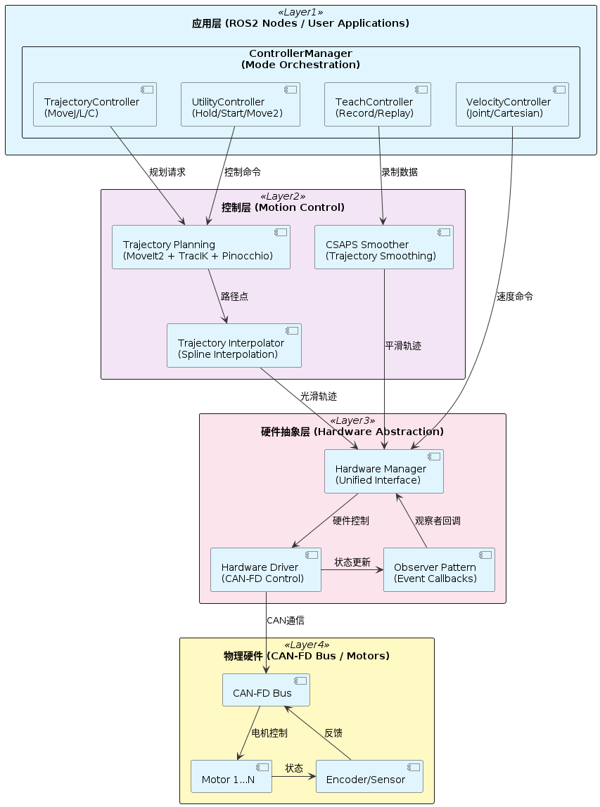

# Universal Arm Controller - 系统集成指南

本指南面向**系统集成者（System Integrator）**，即负责将机械臂控制系统集成到完整机器人产品或产线系统中的工程人员。如果你只是使用本系统控制机械臂，请优先阅读 [Getting Started](../getting_started/README.md) 部分。

---

## 第一层：快速系统适配评估

### 这是什么系统

Universal Arm Controller 是一个基于 ROS 2 的模块化机械臂控制中间层，提供从高层控制指令到硬件执行的完整控制链路。

**核心定位**：
- 屏蔽底层硬件差异，提供统一 ROS 2 控制接口
- 集成轨迹规划、插值、平滑与多种控制模式
- 支持 CAN-FD / EtherCAT 总线的多电机并发控制

**三层架构**：
1. **应用层**：ROS 2 节点、ControllerManager、TrajectoryController
2. **控制层**：轨迹规划（MoveIt2/TracIK/Pinocchio）、插值（Spline/CSAPS）、状态机
3. **硬件层**：硬件抽象接口、总线实现、电机驱动

---

### 适用场景 / 不适用场景

**适用场景**：
- 需要集成 ROS 2 机械臂控制系统（ MoveIt 要求， 其他方面 ROS2 尤其是 ROS通信用的较少）
- 使用 CAN-FD 或 EtherCAT 总线
- 需要多种控制模式（轨迹/速度/示教回放）
- 控制频率要求 100–500 Hz
- 需要快速原型开发或二次开发

**不适用场景**：
- 需要硬实时保证（< 1 μs 抖动）
- 使用非 ROS 2 架构
- 需要功能安全认证（SIL 2/3）
- 只需要简单的位置控制（过度设计）
- 对安全回路有强制性要求（本系统不包含安全 PLC）

---

### 核心能力清单

1. **多臂支持**
   - 单臂控制（`single_arm`）
   - 双臂协同控制（`feature/ipc-dual-arm` 分支）
   - 独立映射（`left_arm` / `right_arm`）

2. **13+ 种控制模式**
   - 轨迹控制：`MoveJ`（关节空间）、`MoveL`（直线）、`MoveC`（圆弧）
   - 速度控制：`JointVelocity`、`CartesianVelocity`
   - 实用控制：`Move2Start`、`Move2Initial`、`HoldState`
   - 示教与回放：`PointRecord`、`TrajectoryRecord`、`PointReplay`、`TrajectoryReplay`

3. **硬件抽象**
   - 统一 Hardware Driver Interface
   - 支持 CAN-FD / EtherCAT 总线切换
   - 多电机并发控制与观察者模式 / 事件回调

4. **ROS 2 原生集成**
   - 基于 ROS 2 Action 的统一控制接口
   - 标准 `/joint_states` 状态反馈
   - 稳定的 `/controller_api/*` 接口

---

### 硬件要求与兼容性

**支持的总线类型**：
- CAN-FD（已验证）
- EtherCAT（未验证）

**最低硬件配置**：
- CPU：ARM64 / x86_64（支持 ROS 2）
- 内存：≥ 2 GB
- 操作系统：Ubuntu 22.04 + ROS 2 Humble

**已验证平台**：
- NVIDIA Jetson Orin（推荐）
- x86_64 工控机 + CAN-FD 卡

**硬件规模支持**：
- 单控制器支持 12+ 电机
- 关节限位动态配置

---

### 典型性能指标

以下数据基于 **x86_64 工控机 + CAN-FD 卡** 平台测试：

| 指标 | 典型值 | 说明 |
|------|--------|------|
| 控制更新频率 | 100 Hz | 可调范围为1 ms以上（默认配置10ms 周期） |
| CAN-FD 数据波特率 | 5 Mbps | 与电机驱动一致 |
| 端到端首段延迟 | < 500 ms | 规划主导 |
| 状态反馈延迟 | 2-5 ms | CAN-FD 通信 + 协议解析（观察者回调本身为微秒级） |
| 内存占用 | < 50 MB | 运行态 |

> [!NOTE]
> 实际性能取决于硬件配置、系统负载与规划复杂度。

---

### 快速决策

**继续阅读[第二层：集成准备](#第二层集成准备)，如果你：**
- 确认系统适配你的应用场景
- 需要了解集成流程与接口定义
- 准备开始系统集成工作

**跳转到[第三层：深入技术细节](#第三层深入技术细节)，如果你：**
- 需要深入了解延迟路径与性能调优
- 需要替换或扩展系统组件
- 遇到集成问题需要排查

**本系统可能不适合，如果你：**
- 硬件平台不兼容（非 ROS 2 / 非 CAN-FD/EtherCAT）
- 性能指标无法满足需求
- 需要功能安全认证

---

## 第二层：集成准备

本章节面向已经确认系统适配性的集成工程师，用于指导最小可运行系统的搭建与验证。

### 系统总体架构



**架构说明**：
- **应用层**：对外提供统一 ROS 2 控制接口，并管理模式切换安全
- **控制层**：负责轨迹规划、插值与控制模式调度
- **硬件层**：屏蔽底层总线差异，提供统一硬件抽象

---

### 系统职责边界

为避免集成歧义，本项目的职责边界定义如下。

**本项目负责的范围**：
- 控制模式管理与切换
- 轨迹规划与轨迹插值
- 统一硬件抽象接口
- 实时通信调度
- ROS 2 对外控制接口

**本项目不负责的范围**：
- 机械结构设计与标定
- 末端执行器驱动与工艺逻辑
- 安全回路（急停、STO、安全 PLC）
- 高层任务规划与视觉系统
- 安全认证与功能安全设计

> [!IMPORTANT]
> 系统集成者需自行完成上述未覆盖部分的系统设计与验证。

---

### 关键接口

**ROS 2 话题与服务**：

| 类型 | 名称 | 描述 |
|------|------|------|
| Topic | `/joint_states` | 当前关节状态 |
| Topic | `/controller_api/*_action` | 控制命令 Action |
| Topic | `/trajectory_control` | 轨迹暂停/恢复/取消 |
| Topic | `/controller_api/running_status` | 当前工作模式 |
| Service | `/controller_api/controller_mode` | 控制模式切换 |

**接口稳定性说明**：
- `/controller_api/*` 话题与服务为**稳定接口**，向后兼容
- 硬件层接口为**内部接口**，仅推荐硬件适配方使用
- 不建议业务系统直接访问硬件层

**硬件接口**：
- 统一 Hardware Driver Interface，详见：[Hardware Driver 库](https://github.com/Ding-Kaiyue/hardware-driver#readme)
- 支持替换不同总线实现（CAN-FD / EtherCAT）
- 支持多电机并发控制与事件回调

---

### 典型集成流程

#### 第 1 步：环境准备

参考 [Getting Started](../getting_started/README.md) 完成环境部署。

#### 第 2 步：启动系统

```bash
ros2 launch robotic_arm_bringup robotic_arm_real.launch.py
```

#### 第 3 步：验证系统

```bash
ros2 service list | grep controller_api
ros2 topic echo /joint_states
```

#### 第 4 步：集成应用
> [!WARNING]
> 以下只是举例说明，实际上需要自行编写 ROS 节点向对应话题发送消息。

```bash
# 切换系统状态
ros2 service call /controller_api/controller_mode \
  controller_interfaces/srv/ControllerMode "{mode: 'MoveJ'}"

# 发送 MoveJ 命令
ros2 topic pub --once /controller_api/movej_action/single_arm \
  sensor_msgs/msg/JointState "{position: [0, 0, 0, 0, 0, 0]}"
```

---

### 最小集成验证清单

在进入业务系统集成前，必须确认：

- [ ] 硬件驱动单独测试通过
- [ ] `/joint_states` 实时稳定输出（`ros2 topic hz /joint_states`）
- [ ] MoveJ 可完成往返运动

---

## 第三层：深入技术细节

> [!TIP]
> 本章节为进阶技术参考。如果你已经完成基本集成且系统运行稳定，可暂时跳过本部分。

### 附录 A：部署拓扑与运行结构

**典型部署结构**：

- **控制节点**
  - ControllerManager
  - TrajectoryController
  - ROS 2 Topics: `/controller_api/*`

- **硬件接口**
  - CAN-FD / EtherCAT 总线
  - 多电机并发控制

- **外部依赖**
  - MoveIt2
  - Pinocchio
  - TracIK
  - CSAPS / Spline

**可选架构：嵌入式轨迹执行**

对于产品化场景，可将轨迹执行下放到嵌入式控制器（如 STM32）：

```
工控机 (ROS 2 + 规划 + 插值)
  ↓ 轨迹点数组 (USB/Ethernet)
STM32 (execute_trajectory + CAN 通信)
  ↓ CAN-FD 实时指令
电机驱动器
```

**优势**：
- 降低主控实时性要求
- 提高集成度与成本效益
- 确定性任务由嵌入式处理

**权衡**：
- 首段延迟增加 10-50 ms（轨迹传输）
- 需要设计可靠的通信协议
- 长轨迹需分段传输

**集成注意事项**：

**硬件配置**：
- 确保 CAN / EtherCAT 总线稳定
- 配置正确的波特率与帧格式
- 验证电机地址与参数映射
- 建议绑定 CPU 亲和性以提升实时性（默认已绑定）

**ROS 2 配置**：
- 本系统默认使用 `Reliable` QoS，建议集成时保持一致
- 控制回路已隔离，避免在业务逻辑中引入阻塞操作
- 规划线程与控制线程已分离，无需额外配置

**系统级集成**：
- 集成前必须进行独立硬件测试
- 验证所有话题与服务可用性
- 本系统已提供日志输出和状态话题，建议接入业务系统的监控平台

---

### 附录 B：延迟路径分析

**延迟组成**：

1. **应用层延迟**
   - ROS 2 通信：1–2 ms

2. **规划延迟**
   - 轨迹规划：50–500 ms（与规划复杂度相关）

3. **插值延迟**
   - 轨迹生成：< 1 ms

4. **硬件延迟**
   - CAN 通信 + 电机响应：~200 μs

**端到端首段延迟**：通常 < 500 ms，规划主导。

> [!TIP]
> **结论性说明**
>
> 在典型配置下，本系统的端到端延迟主要由"轨迹规划阶段"主导，控制回路与硬件链路延迟对系统响应的影响较小。

---

### 附录 C：可替换组件与扩展性

系统采用模块化设计，推荐扩展点如下：

| 组件 | 稳定性 | 推荐级别 | 说明 |
|------|--------|----------|------|
| Hardware Driver | 稳定接口 | 强烈推荐新增与替换 | 当前仅支持CANFD, <br/>为不同总线与电机留有接口 |
| Trajectory Planning | 半稳定 | 推荐有经验团队替换 | 可接入自定义规划器 |
| Trajectory Interpolator | 内部实现 | 谨慎替换 | 影响实时性与平滑性 |
| CSAPS | 内部实现 | 不建议直接替换 | 平滑算法内部使用 |

---

### 附录 D：常见集成风险与解决方案

**风险场景与解决方案**：

| 风险 | 表现 | 解决方案 |
|------|------|----------|
| CAN 总线抖动 | 控制周期不稳定 | 检查总线负载、波特率配置、终端电阻 |
| 规划时间过长 | 上层系统超时 | 调整规划器参数、简化路径、增加超时时间 |
| QoS 配置不当 | 状态丢失 | 使用 RELIABLE QoS、增加队列深度 |

**集成阶段应重点覆盖上述风险场景的测试。**

---

### 附录 E：性能调优建议

**实时性优化**：
- 本系统默认绑定控制线程到 CPU 核心 4，可通过 `hardware-driver`子仓库的配置调整
- 使用 PREEMPT_RT 内核（可选）
- 调整 ROS 2 DDS 参数（Fast-DDS / CycloneDDS）
- 减少系统后台任务

**规划性能优化**：
- 调整 MoveIt2 规划时间限制
- 使用简化的碰撞检测模型
- 缓存常用轨迹

**硬件层优化**：
- 切换为 EtherCAT 通信
- 减少电机反馈数据量
- 更换硬件为实时操作系统
  
---

> [!NOTE]
> 更多信息请访问 **[文档中心](../README.md)**
