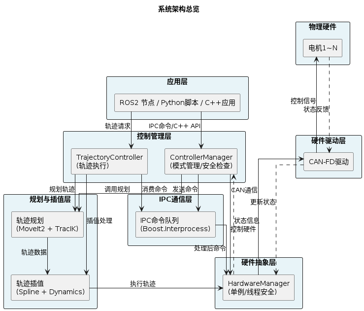
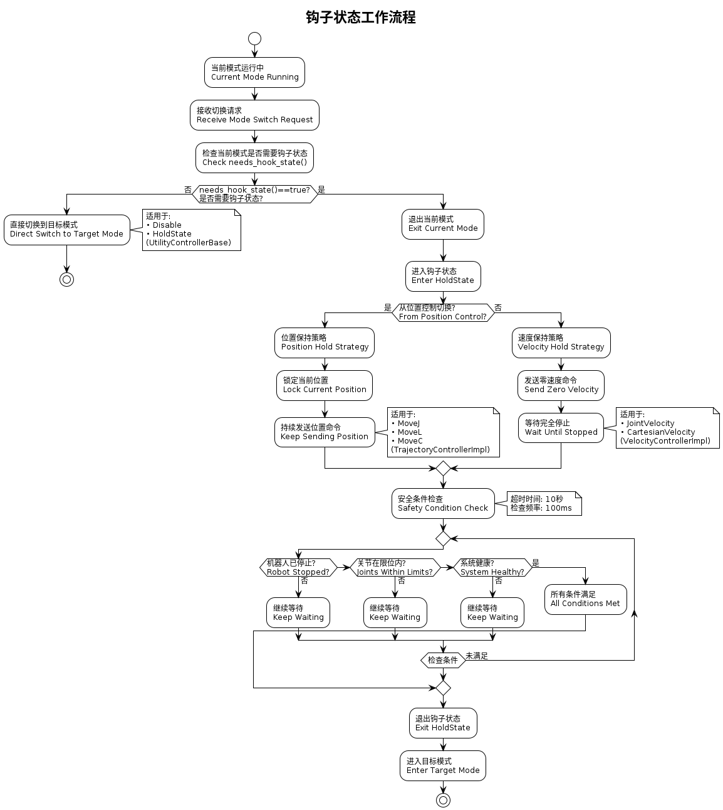

# 系统架构

本文档详细介绍 Arm Controller 的系统架构设计。

## 📋 目录

- [架构概览](#架构概览)
- [双节点架构](#双节点架构)
- [核心组件](#核心组件)
- [控制器架构](#控制器架构)
- [依赖组件集成](#依赖组件集成)
- [数据流](#数据流)
- [设计模式](#设计模式)

---

## 架构概览

### 系统架构图

</div align="center">



</div>

### 设计理念

Arm Controller 基于以下设计理念:

1. **职责分离**: 将状态管理和轨迹执行分离到不同节点
2. **模块化**: 控制器采用插件式架构,易于扩展
3. **线程安全**: 关键组件采用单例模式和互斥锁保护
4. **实时性**: 硬件通信和控制循环独立线程运行
5. **安全性**: 多层安全检查,钩子状态机制

---

## 双节点架构

### 节点职责

#### 1. ControllerManagerNode (控制管理节点)

**主要职责**:
- 创建和管理所有控制模式的控制器实例
- 工作模式切换和状态管理
- 处理安全状态转换（钩子状态）
- 系统状态发布

**关键接口**:
```cpp
// 服务
/controller_api/controller_mode (controller_interfaces/srv/WorkMode) // 工作模式切换

// 话题
/controller_api/running_status (std_msgs/msg/String)                 // 当前工作模式
/controller_api/motor_control (controller_interfaces/msg/MotorControl) // 电机控制指令 Enable/Disable
/controller_api/movej_action/single_arm (sensor_msgs/msg/JointState)            // movej目标点
/controller_api/movel_action/single_arm (geometry_msgs/msg/Pose)                // movel目标点
/controller_api/movec_action/single_arm (geometry_msgs/msg/PoseArray)           // movec目标点
/controller_api/joint_velocity_action/single_arm (sensor_msgs/msg/JointState)   // 关节速度控制目标速度
```

**核心功能** - 见 [controller_manager_section.hpp](../include/arm_controller/controller_manager_section.hpp):
- 从 YAML 配置加载所有控制器
- 通过 WorkMode 服务处理模式切换
- 管理 HoldState 确保安全过渡
- 发布运行状态和监听轨迹执行完成事件

#### 2. TrajectoryControllerNode (轨迹执行节点)

**主要职责**:
- 接收和执行轨迹执行请求
- 轨迹插值和优化
- 与硬件管理器交互执行运动

**关键接口**:
```cpp
// Action Server (每个映射独立)
/arm_controller/follow_joint_trajectory (control_msgs/action/FollowJointTrajectory)

// 话题
/action_controller_events (std_msgs/msg/String)  // 发布轨迹执行事件：START, PAUSE, RESUME, STOP
```

**核心功能** - 见 [trajectory_controller_section.hpp](../include/arm_controller/trajectory_controller_section.hpp):
- 为每个机械臂映射维护独立的 Action Server
- 使用 TrajectoryInterpolator 进行轨迹光滑化
- 通过 TrajectoryConverter 进行轨迹格式转换
- 发布轨迹执行事件供 ControllerManagerNode 监听

### 节点通信

```
用户/MoveIt
    │
    ├──► ControllerManagerNode (WorkMode Service)
    │         │
    │         ├──► start_working_controller()
    │         │    └──► ModeControllerBase::start(mapping)
    |         |         ├──► TrajectoryInterpolator (插值)
    │         │         └──► HardwareManager (轨迹执行)
    │         └──► 监听 /action_controller_events 话题
    │
    └──► TrajectoryControllerNode (Action Server)
              │
              ├──► execute_trajectory()
              │    ├──► TrajectoryInterpolator (插值)
              │    └──► HardwareManager (轨迹执行)
              └──► 发布 /action_controller_events 话题
```

### 并行执行

两个节点在同一进程中并行运行，见 [main 入口](../src/main.cpp)。

使用 `MultiThreadedExecutor` 确保两个节点可以独立且并发地处理各自的回调和事件。

---

## 其他组件

### HardwareManager (单例硬件管理)

**职责**:
- 管理所有电机的 CAN-FD 通信
- 封装 hardware_driver 库接口
- 提供线程安全的硬件访问接口

**实现**:
见 [hardware_manager.hpp](../include/arm_controller/hardware/hardware_manager.hpp)

关键功能：
- 单例实例管理（线程安全）
- 支持多个机械臂映射 (single_arm/left_arm/right_arm)
- 电机控制接口：位置控制、速度控制、力矩控制、MIT 模式等
- 电机状态缓存和查询
- 支持观察者模式进行状态变化通知

---

## 控制器架构

### 控制器接口

所有控制器实现统一接口，见 [mode_controller_base.hpp](../include/arm_controller/controller_base/mode_controller_base.hpp)

关键方法：
- `start(mapping)` - 控制器激活时调用
- `stop(mapping)` - 控制器停用时调用
- `handle_message(msg)` - 处理接收到的消息
- `needs_hook_state()` - 状态转移时是否需要钩子状态

### 控制器分类

#### 1. 轨迹控制器基类

见 [trajectory_controller_base.hpp](../include/arm_controller/controller_base/trajectory_controller_base.hpp)

职责：
- 规划轨迹（调用 trajectory_planning）
- 插值轨迹（调用 trajectory_interpolator）
- 执行轨迹（调用 HardwareManager）

#### 2. 速度控制器基类

见 [velocity_controller_base.hpp](../include/arm_controller/controller_base/velocity_controller_base.hpp)

职责：
- 安全检查（关节限位、速度限制）
- 速度控制执行

### 状态机设计

状态转移遵循以下规则：

</div align="center">



</div>

**状态转移规则**:

1. **MoveJ/MoveL/MoveC/JointVelocity 之间的转移**:
   - 如果当前控制器的 `needs_hook_state()` 返回 true，则必须先转移到 HoldState
   - HoldState 会持续监控转移条件（如轨迹执行完成、速度降为零等）
   - 条件满足时，自动转移到目标模式

2. **任意模式回到 HoldState**:
   - 所有模式都支持转移到 HoldState
   - HoldState 是一个中间安全状态，用于模式间的缓冲和过渡

---

## 依赖组件集成

### 1. trajectory_planning 集成

见 [movej_controller.cpp](../src/controller/movej/movej_controller.cpp)、[movel_controller.cpp](../src/controller/movel/movel_controller.cpp)、[movec_controller.cpp](../src/controller/movec/movec_controller.cpp)

**集成方式**:
- 各控制器在 `initialize_planning_services()` 中创建 `MoveItAdapter` 和 `MotionPlanningService`
- 注册对应的规划策略：`registerMoveJStrategy()`、`registerMoveLStrategy()`、`registerMoveCStrategy()`
- 在 `plan_and_execute()` 方法中调用规划服务：`planJointMotion()`、`planLinearMotion()`、`planArcMotion()`
- 规划完成后获得轨迹点列表，通过 `TrajectoryConverter` 转换为插值器格式

**集成点**:
- 各控制器初始化时创建规划服务实例（支持多 mapping）
- 在 `trajectory_callback()` 中接收目标点请求
- 调用 `plan_and_execute()` 进行规划和执行

### 2. trajectory_interpolator 集成

见 [trajectory_converter.hpp](../include/arm_controller/utils/trajectory_converter.hpp)、[movej_controller.cpp](../src/controller/movej/movej_controller.cpp)、[movel_controller.cpp](../src/controller/movel/movel_controller.cpp)、[movec_controller.cpp](../src/controller/movec/movec_controller.cpp)

**集成方式**:
- 各控制器在构造函数中创建 `TrajectoryInterpolator` 实例
- 规划完成后通过 `TrajectoryConverter::convertPlanningToInterpolator()` 转换轨迹格式
- 通过 `TrajectoryConverter::analyzeTrajectoryDynamics()` 分析轨迹动力学参数
- 在 `interpolate_trajectory()` 方法中调用 `loadTrajectoryWithDynamicConfig()` 和 `interpolate()` 进行插值

**集成点**:
- 各轨迹控制器：在 `plan_and_execute()` 中执行插值并生成光滑轨迹
- 动力学分析：通过规划结果计算安全的插值参数（速度、加速度、加加速度限制）

### 3. hardware_driver 集成

见 [hardware_manager.hpp](../include/arm_controller/hardware/hardware_manager.hpp)

**集成方式**:
- HardwareManager 单例类封装了所有 hardware_driver 接口
- 提供统一的硬件控制接口：位置控制、速度控制、力矩控制等
- 通过 CAN-FD 总线与电机通信

**集成点**:
- ControllerManagerNode 和 TrajectoryControllerNode: 初始化 HardwareManager 实例
- 所有控制器: 通过 HardwareManager 的公共接口访问和控制硬件
- 状态反馈: HardwareManager 缓存并提供电机的实时状态信息

---

## 数据流

### 位置控制数据流

```
用户指令 → MoveJ Controller
           ↓
    MoveIt 规划 (trajectory_planning)
           ↓
    轨迹插值 (trajectory_interpolator)
           ↓
    HardwareManager
           ↓
    Hardware Driver (hardware_driver)
           ↓
    CAN-FD → 电机
```

### 速度控制数据流

```
用户指令 → JointVelocity Controller
           ↓
    安全检查 (限位、急停)
           ↓
    HardwareManager
           ↓
    Hardware Driver
           ↓
    CAN-FD → 电机
```

### 状态反馈数据流

```
电机 → CAN-FD
    ↓
Hardware Driver (Observer Pattern)
    ↓
HardwareManager (缓存状态)
    ↓
ControllerManagerNode / TrajectoryControllerNode
    ↓
/joint_states 话题
    ↓
用户 / MoveIt
```

---

## 设计模式

### 1. 单例模式 (Singleton)

**应用**: HardwareManager

**目的**: 确保全局唯一的硬件访问点

### 2. 策略模式 (Strategy)

**应用**: 控制器架构

**目的**: 运行时切换不同的控制策略

见 [controller_manager_section.hpp](../include/arm_controller/controller_manager_section.hpp)

ControllerManagerNode 通过 `switch_to_mode(mode, mapping)` 方法在不同的 ModeControllerBase 子类间切换（MoveJ、MoveL、MoveC、JointVelocity 等），每次切换时调用前一个控制器的 `stop(mapping)` 和新控制器的 `start(mapping)`。

### 3. 观察者模式 (Observer)

**应用**: 硬件状态更新

**目的**: 实时接收电机状态变化

见 [hardware_manager.hpp](../include/arm_controller/hardware/hardware_manager.hpp)

HardwareManager 通过观察者模式接收来自 hardware_driver 的电机状态变化，定期缓存和更新电机的位置、速度、加速度等信息，供控制器和其他模块查询。

### 4. 工厂模式 (Factory)

**应用**: ControllerFactory

**目的**: 统一创建和配置控制器

### 5. 状态模式 (State)

**应用**: HoldState 安全钩子

**目的**: 封装模式切换时的状态转换

---

## 线程模型

```
Main Thread
  │
  ├──► MultiThreadedExecutor (spin())
  │     │
  │     ├──► ControllerManagerNode
  │     │     ├──► Service Callback (/controller_api/controller_mode)
  │     │     ├──► Timer Callback (1Hz, 发布状态)
  │     │     └──► Subscription Callback (监听 /action_controller_events)
  │     │
  │     └──► TrajectoryControllerNode
  │           ├──► Action Server Callbacks (FollowJointTrajectory，每个mapping独立)
  │           └──► Executor 线程池（处理多个callback）
  │
  └──► HardwareManager (Singleton)
        │
        └──► CanFdBus (hardware_driver)
              ├──► CAN 接收线程（每个接口一个）
              │     └──► MotorStatusObserver Callback
              └──► CAN 发送（同步执行，无专门线程）
```

**执行模型**:
- 使用 `MultiThreadedExecutor` 管理两个节点的 callback 执行
- ControllerManagerNode 和 TrajectoryControllerNode 共享同一个执行器
- hardware_driver 的 CanFdBus 维护独立的接收线程池（每个 CAN 接口一个线程）
- 发送操作在调用线程中同步执行

**线程安全保证**:
- HardwareManager: 单例 + 互斥锁（`instance_mutex_`, `joint_state_mutex_`, `status_mutex_`）确保全局唯一实例和状态访问安全
- 控制器切换: HoldState 机制和互斥锁保护状态转移
- 节点间通信: ROS2 话题和服务提供线程安全（QoS reliable）
- 硬件通信: CanFdBus 通过线程池管理 CAN 接收，send() 在调用线程中同步执行
- 观察者回调: MotorStatusObserver 在接收线程中被调用，通过互斥锁保护状态更新

---

## 配置管理

```
config/
  ├── hardware_config.yaml        # 硬件配置：机械臂映射、电机ID、接口信息
  ├── config.yaml                 # 控制器配置：所有控制器的定义和订阅话题配置
  ├── interpolator_config.yaml    # 轨迹插值器配置
  ├── arm380_joint_limits.yaml     # ARM380 关节限位配置
  └── arm620_joint_limits.yaml     # ARM620 关节限位配置
```

**加载流程**:
- 系统启动时，`ControllerManagerNode::load_config()` 加载 `config.yaml`
- `HardwareManager::initialize()` 加载 `hardware_config.yaml` 和关节限位配置
- `ControllerManagerNode::init_controllers()` 根据 `config.yaml` 中的 `controllers` 部分创建并注册所有控制器
- 各控制器在初始化时读取 `config.yaml` 中的参数（如 `input_topic`）

**config.yaml 结构**:
- `common`: 全局话题和服务定义（服务、发布话题等）
- `controllers`: 所有控制器的配置，包括类名、输入话题名称和类型等

---

## 性能参数

### 1. 控制频率

- **状态发布频率**: 1Hz (ControllerManagerNode，发送当前控制模式)
- **HoldState 安全检查频率**: 100ms (每个 mapping 一个定时器)
- **硬件通信频率**: 取决于 CAN-FD 接收线程和电机反馈速率

### 2. 超时和安全检查

- **HoldState 超时**: 无硬性超时，持续检查直到满足安全条件
- **安全条件检查**:
  - 机器人已停止（关节速度接近零）
  - 关节在限位范围内
  - 系统健康（无故障、无紧急停止）
- **日志输出频率**: 1000ms（DEBUG 和 WARN 级别的 throttle 设置）

### 3. 实现特点

- **动态保持策略**: 根据前一个模式选择位置保持或速度保持
- **并行执行**: 多个 mapping 可以独立运行各自的 HoldState 超时检查
- **自适应安全检查**: 系统不健康时暂停安全检查，恢复后自动恢复

---

## 扩展性

### 添加新控制器

1. 继承 `ModeControllerBase` 或 `TrajectoryControllerBase` 类
2. 实现 `start(mapping)`, `stop(mapping)`方法
3. 在 `ControllerManagerNode::init_controllers()` 中创建实例并注册
4. 在配置文件中添加控制器参数
5. 添加对应的消息订阅/发布

### 添加新硬件

1. 在 hardwre_driver 中实现

### 添加新规划策略

1. 在 trajectory_planning 中实现
2. 在控制器中调用新策略
3. 添加配置参数

---

## 下一步

- 查看 [开发者指南](DEVELOPER.md) 了解开发流程
- 查看 [控制器详解](CONTROLLERS.md) 了解具体实现
- 查看 [安全机制](SAFETY.md) 了解安全设计
