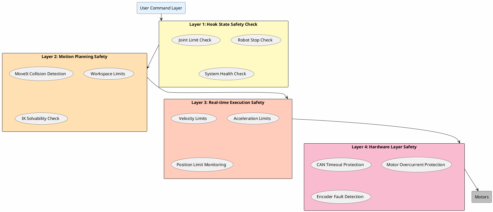

# 安全机制

本文档详细介绍 Arm Controller 的安全保护机制。

## 📋 目录

- [安全机制](#安全机制)
  - [📋 目录](#-目录)
  - [安全概览](#安全概览)
  - [钩子状态机制](#钩子状态机制)
  - [实时限位保护](#实时限位保护)
  - [急停处理](#急停处理)
  - [碰撞检测](#碰撞检测)
  - [安全配置](#安全配置)
  - [故障恢复](#故障恢复)
  - [安全检查清单](#安全检查清单)
  - [相关文档](#相关文档)

---

## 安全概览

### Multi-Layer Safety Architecture



### 安全原则

1. **防御性编程**: 所有输入都进行验证
2. **故障安全**: 出错时自动进入安全状态
3. **冗余检查**: 关键安全条件多层验证
4. **实时监控**: 持续监控系统状态
5. **可恢复性**: 提供故障恢复机制

---

## 钩子状态机制

### 什么是钩子状态?

钩子状态(HoldState)是模式切换时的**安全过渡状态**,确保机器人在切换控制模式前满足所有安全条件。

### 工作原理

```
当前模式 ──► HoldState ──► 目标模式
  (退出)       (安全检查)      (进入)
               │
               ├─► ✓ 机器人已停止?
               ├─► ✓ 关节在限位内?
               ├─► ✓ 系统健康?
               │
               └─► 所有条件满足 → 允许切换
                   任一条件不满足 → 继续等待
```

### 两种保持策略

#### 1. 位置保持策略

**适用场景**: 从位置控制模式切换时

**工作方式**:
```cpp
// 进入 HoldState 时
void HoldState::onEnter(const std::string& mapping) {
    // 1. 读取当前关节位置
    hold_positions_ = hardware_manager_->getJointPositions(mapping);

    // 2. 持续发送保持命令
    while (!allSafetyConditionsMet()) {
        hardware_manager_->controlMotor(mapping, hold_positions_);
        std::this_thread::sleep_for(std::chrono::milliseconds(10));
    }
}
```

**特点**:
- ✅ 机器人保持当前位置
- ✅ 防止重力导致下垂
- ✅ 适用于 MoveJ, MoveL, MoveC 等

#### 2. 速度保持策略

**适用场景**: 从速度控制模式切换时

**工作方式**:
```cpp
// 进入 HoldState 时
void HoldState::onEnter(const std::string& mapping) {
    // 1. 发送零速度命令
    std::vector<double> zero_velocity(joint_count, 0.0);
    hardware_manager_->controlMotorVelocity(mapping, zero_velocity);

    // 2. 等待机器人完全停止
    while (!isStopped()) {
        // 持续监控速度
        auto velocities = hardware_manager_->getJointVelocities(mapping);
        if (allVelocitiesNearZero(velocities)) {
            break;
        }
        std::this_thread::sleep_for(std::chrono::milliseconds(10));
    }
}
```

**特点**:
- ✅ 平滑减速到停止
- ✅ 无突变冲击
- ✅ 适用于 JointVelocity 等

### 安全条件检查

#### 1. 机器人停止检查

```cpp
bool HoldState::isRobotStopped() const {
    auto velocities = hardware_manager_->getJointVelocities(mapping_);

    for (double vel : velocities) {
        if (std::abs(vel) > velocity_threshold_) {  // 默认 0.01 rad/s
            return false;
        }
    }
    return true;
}
```

#### 2. 关节限位检查

```cpp
bool HoldState::areJointsWithinLimits() const {
    auto positions = hardware_manager_->getJointPositions(mapping_);
    auto& limits = hardware_config_.position_limits;

    for (size_t i = 0; i < positions.size(); ++i) {
        if (positions[i] < limits.lower[i] ||
            positions[i] > limits.upper[i]) {
            RCLCPP_WARN(logger_, "Joint %zu out of limits: %.3f",
                       i, positions[i]);
            return false;
        }
    }
    return true;
}
```

#### 3. 系统健康检查

```cpp
bool HoldState::isSystemHealthy() const {
    // 检查 CAN 通信
    if (!hardware_manager_->isCANAlive()) {
        return false;
    }

    // 检查电机状态
    if (!hardware_manager_->areMotorsEnabled(mapping_)) {
        return false;
    }

    // 检查编码器
    if (!hardware_manager_->areEncodersValid(mapping_)) {
        return false;
    }

    return true;
}
```

### 跳过钩子状态

某些控制器可以跳过钩子状态:

```cpp
class DisableController : public IController {
public:
    bool requiresHookState() const override {
        return false;  // Disable 直接执行,无需安全检查
    }
};
```

### 超时处理

```cpp
bool HoldState::waitForSafetyConditions(
    std::chrono::seconds timeout = std::chrono::seconds(10)) {

    auto start = std::chrono::steady_clock::now();

    while (!allSafetyConditionsMet()) {
        auto elapsed = std::chrono::steady_clock::now() - start;
        if (elapsed > timeout) {
            RCLCPP_ERROR(logger_, "HoldState timeout! Safety conditions not met.");
            return false;
        }
        std::this_thread::sleep_for(std::chrono::milliseconds(100));
    }
    return true;
}
```

---

## 实时限位保护

### 位置限位

#### 软限位配置

```yaml
# config/hardware_config.yaml
hardware_interfaces:
  single_arm:
    position_limits:
      lower: [-3.14, -2.09, -2.09, -3.14, -2.09, -3.14]  # 弧度
      upper: [3.14, 2.09, 2.09, 3.14, 2.09, 3.14]
```

#### 实时监控

```cpp
bool SafetyMonitor::checkPositionLimits(
    const std::vector<double>& positions) {

    for (size_t i = 0; i < positions.size(); ++i) {
        // 检查是否超限
        if (positions[i] < position_limits_lower_[i]) {
            RCLCPP_ERROR(logger_, "Joint %zu below lower limit: %.3f < %.3f",
                        i, positions[i], position_limits_lower_[i]);
            triggerEmergencyStop();
            return false;
        }

        if (positions[i] > position_limits_upper_[i]) {
            RCLCPP_ERROR(logger_, "Joint %zu above upper limit: %.3f > %.3f",
                        i, positions[i], position_limits_upper_[i]);
            triggerEmergencyStop();
            return false;
        }

        // 检查是否接近限位
        double margin = 0.1;  // 弧度
        if (positions[i] < position_limits_lower_[i] + margin ||
            positions[i] > position_limits_upper_[i] - margin) {
            RCLCPP_WARN(logger_, "Joint %zu approaching limits!", i);
        }
    }
    return true;
}
```

### 速度限位

```yaml
# config/config.yaml
joint_velocity:
  max_velocity: [3.14, 3.14, 3.14, 3.14, 3.14, 3.14]  # rad/s
```

```cpp
bool SafetyMonitor::checkVelocityLimits(
    const std::vector<double>& velocities) {

    for (size_t i = 0; i < velocities.size(); ++i) {
        if (std::abs(velocities[i]) > max_velocities_[i]) {
            RCLCPP_ERROR(logger_, "Joint %zu velocity exceeds limit: %.3f > %.3f",
                        i, std::abs(velocities[i]), max_velocities_[i]);
            return false;
        }
    }
    return true;
}
```

**自动限制**:
```cpp
std::vector<double> SafetyMonitor::clampVelocities(
    const std::vector<double>& velocities) {

    std::vector<double> clamped = velocities;
    for (size_t i = 0; i < clamped.size(); ++i) {
        clamped[i] = std::clamp(clamped[i],
                               -max_velocities_[i],
                               max_velocities_[i]);
    }
    return clamped;
}
```

### 加速度限位

```yaml
# config/config.yaml
safety:
  max_acceleration: [5.0, 5.0, 5.0, 5.0, 5.0, 5.0]  # rad/s²
```

```cpp
bool SafetyMonitor::checkAccelerationLimits(
    const std::vector<double>& current_velocities,
    const std::vector<double>& target_velocities,
    double dt) {

    for (size_t i = 0; i < current_velocities.size(); ++i) {
        double acceleration = (target_velocities[i] - current_velocities[i]) / dt;

        if (std::abs(acceleration) > max_accelerations_[i]) {
            RCLCPP_WARN(logger_, "Joint %zu acceleration too high: %.3f",
                       i, acceleration);
            return false;
        }
    }
    return true;
}
```

---

## 急停处理

### 触发条件

1. **位置超限**: 关节位置超出软限位
2. **速度过高**: 关节速度超出最大值
3. **通信丢失**: CAN 通信超时
4. **硬件故障**: 电机或编码器故障
5. **用户请求**: 手动触发急停

### 急停流程

```cpp
void SafetyMonitor::triggerEmergencyStop() {
    RCLCPP_ERROR(logger_, "EMERGENCY STOP TRIGGERED!");

    // 1. 设置急停标志
    emergency_stop_flag_ = true;

    // 2. 发送零速度命令
    std::vector<double> zero_velocity(joint_count_, 0.0);
    hardware_manager_->controlMotorVelocity(mapping_, zero_velocity);

    // 3. 通知控制器管理器
    controller_manager_->notifyEmergencyStop();

    // 4. 记录急停原因
    logEmergencyStopReason();

    // 5. 等待用户确认
    waitForUserConfirmation();
}
```

### 急停状态

```
正常运行 ──► 急停触发 ──► 急停状态
                           │
                           ├─► 记录原因
                           ├─► 停止运动
                           ├─► 禁用危险操作
                           └─► 等待恢复
                                │
                        ┌───────▼───────┐
                        │ 安全反向运动  │
                        │(仅允许离开限位)│
                        └───────┬───────┘
                                │
                        ┌───────▼───────┐
                        │ 用户确认恢复  │
                        └───────┬───────┘
                                │
                           正常运行
```

### 安全反向运动

急停状态下允许反向运动以脱离限位区:

```cpp
bool JointVelocityController::isSafeDirectionInEmergency(
    const std::vector<double>& velocities) {

    if (!emergency_stop_flag_) {
        return true;  // 非急停状态,所有方向都安全
    }

    auto positions = hardware_manager_->getJointPositions(mapping_);

    for (size_t i = 0; i < velocities.size(); ++i) {
        // 检查关节是否超下限
        if (positions[i] < position_limits_lower_[i]) {
            // 只允许正向运动(远离下限)
            if (velocities[i] < 0) {
                RCLCPP_WARN(logger_,
                           "Joint %zu: Cannot move further below limit!", i);
                return false;
            }
        }

        // 检查关节是否超上限
        if (positions[i] > position_limits_upper_[i]) {
            // 只允许负向运动(远离上限)
            if (velocities[i] > 0) {
                RCLCPP_WARN(logger_,
                           "Joint %zu: Cannot move further above limit!", i);
                return false;
            }
        }
    }

    return true;  // 允许安全方向的运动
}
```

### 恢复流程

```cpp
void SafetyMonitor::recoverFromEmergencyStop() {
    // 1. 检查所有关节是否回到限位内
    if (!areJointsWithinLimits()) {
        RCLCPP_ERROR(logger_, "Cannot recover: joints still out of limits!");
        return;
    }

    // 2. 检查系统健康
    if (!isSystemHealthy()) {
        RCLCPP_ERROR(logger_, "Cannot recover: system not healthy!");
        return;
    }

    // 3. 清除急停标志
    emergency_stop_flag_ = false;

    // 4. 重置控制器状态
    controller_manager_->reset();

    RCLCPP_INFO(logger_, "Emergency stop recovered. System ready.");
}
```

---

## 碰撞检测

### MoveIt 碰撞检测

#### 规划阶段检测

```cpp
bool MoveJController::planMotion(const JointState& goal) {
    // MoveIt 会自动检查碰撞
    auto result = planning_service_->planJointMotion(goal);

    if (!result.success) {
        if (result.error_code == ErrorCode::COLLISION_DETECTED) {
            RCLCPP_ERROR(logger_, "Planning failed: collision detected!");
            return false;
        }
    }

    return true;
}
```

#### 碰撞场景更新

```yaml
# MoveIt 配置
planning_scene_monitor:
  publish_planning_scene: true
  publish_geometry_updates: true
  publish_state_updates: true
  publish_transforms_updates: true
```

### MoveL 智能碰撞规避

```cpp
bool MoveLController::planWithCollisionAvoidance(const Pose& goal) {
    // 1. 尝试笛卡尔规划
    auto result = planning_service_->planLinearMotion(goal, CARTESIAN_SPACE);

    if (result.success) {
        return true;
    }

    // 2. 如果碰撞,回退规划
    if (result.error_code == ErrorCode::COLLISION_DETECTED) {
        RCLCPP_WARN(logger_, "Cartesian path collides, trying fallback...");

        // 回退到关节空间规划
        result = planning_service_->planLinearMotion(goal, JOINT_SPACE);

        if (result.success) {
            RCLCPP_INFO(logger_, "Fallback planning successful!");
            return true;
        }
    }

    return false;
}
```

### 自碰撞检测

```yaml
# SRDF 配置
robot_description_semantic:
  self_collision_checks:
    - link1: "link_1"
      link2: "link_2"
      reason: "Adjacent links"
```

---

## 安全配置

### 配置文件

```yaml
# config/safety_config.yaml
safety:
  # 位置限位
  position_limits:
    lower: [-3.14, -2.09, -2.09, -3.14, -2.09, -3.14]
    upper: [3.14, 2.09, 2.09, 3.14, 2.09, 3.14]

  # 速度限位
  max_velocity: [3.14, 3.14, 3.14, 3.14, 3.14, 3.14]  # rad/s

  # 加速度限位
  max_acceleration: [5.0, 5.0, 5.0, 5.0, 5.0, 5.0]  # rad/s²

  # 安全阈值
  velocity_stopped_threshold: 0.01  # rad/s
  position_limit_margin: 0.1        # rad

  # 超时设置
  holdstate_timeout: 10.0           # 秒
  can_communication_timeout: 1.0    # 秒

  # 急停设置
  emergency_stop:
    auto_trigger: true
    allow_safe_direction: true
```

### 加载配置

```cpp
class SafetyMonitor {
public:
    void loadConfig(const std::string& config_file) {
        YAML::Node config = YAML::LoadFile(config_file);

        auto safety = config["safety"];

        // 加载限位
        position_limits_lower_ = safety["position_limits"]["lower"]
            .as<std::vector<double>>();
        position_limits_upper_ = safety["position_limits"]["upper"]
            .as<std::vector<double>>();

        // 加载速度限制
        max_velocities_ = safety["max_velocity"].as<std::vector<double>>();

        // 加载阈值
        velocity_threshold_ = safety["velocity_stopped_threshold"].as<double>();

        RCLCPP_INFO(logger_, "Safety configuration loaded successfully.");
    }
};
```

---

## 故障恢复

### 恢复策略

| 故障类型 | 自动恢复 | 手动干预 |
|---------|---------|---------|
| CAN 通信超时 | ✅ 重连 | - |
| 关节超限 | ✅ 安全反向 | ✅ 确认恢复 |
| 规划失败 | ✅ 重试 | - |
| 急停触发 | - | ✅ 确认恢复 |
| 硬件故障 | - | ✅ 维修后重启 |

### 自动重试

```cpp
bool ControllerManager::executionWithRetry(
    std::function<bool()> operation,
    int max_retries = 3) {

    for (int attempt = 0; attempt < max_retries; ++attempt) {
        if (operation()) {
            return true;
        }

        RCLCPP_WARN(logger_, "Attempt %d/%d failed, retrying...",
                   attempt + 1, max_retries);
        std::this_thread::sleep_for(std::chrono::milliseconds(500));
    }

    RCLCPP_ERROR(logger_, "Operation failed after %d attempts", max_retries);
    return false;
}
```

### 状态恢复

```cpp
void ControllerManager::saveState() {
    saved_state_.mode = current_mode_;
    saved_state_.mapping = current_mapping_;
    saved_state_.positions = hardware_manager_->getJointPositions(current_mapping_);
}

void ControllerManager::restoreState() {
    switchMode(saved_state_.mode, saved_state_.mapping);
    // 可选: 恢复到保存的位置
}
```

---

## 安全检查清单

在使用系统前,确保:

- [ ] CAN 接口正确配置
- [ ] 电机 ID 配置正确
- [ ] 限位参数已根据实际机器人设置
- [ ] 急停按钮(如有)正常工作
- [ ] 工作空间清空障碍物
- [ ] 已进行空载测试
- [ ] 已测试急停功能
- [ ] 操作人员已接受培训

---

## 相关文档

- [控制器详解](CONTROLLERS.md) - 各控制器的安全特性
- [故障排除](TROUBLESHOOTING.md) - 安全相关问题排查
- [配置指南](CONFIGURATION.md) - 安全参数配置
