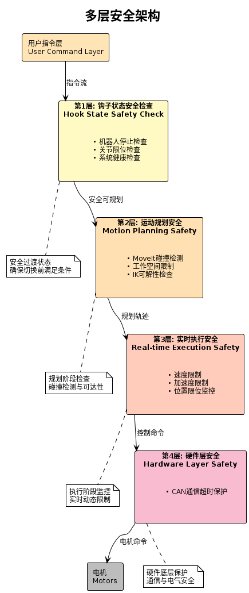

# 安全机制

本文档详细介绍 Arm Controller 的安全保护机制。

## 📋 目录

- [安全机制](#安全机制)
  - [📋 目录](#-目录)
  - [安全概览](#安全概览)
  - [钩子状态机制](#钩子状态机制)
  - [实时限位保护](#实时限位保护)
  - [急停处理](#急停处理)
  - [碰撞检测](#碰撞检测)
  - [安全配置](#安全配置)
  - [故障恢复](#故障恢复)
  - [安全检查清单](#安全检查清单)
  - [相关文档](#相关文档)

---

## 安全概览

### Multi-Layer Safety Architecture

<div align="center">



</div>

### 安全原则

1. **防御性编程**: 所有输入都进行验证
2. **故障安全**: 出错时自动进入安全状态
3. **冗余检查**: 关键安全条件多层验证
4. **实时监控**: 持续监控系统状态
5. **可恢复性**: 提供故障恢复机制

---

## 钩子状态机制

### 什么是钩子状态?

钩子状态(HoldState)是模式切换时的**安全过渡状态**,确保机器人在切换控制模式前满足所有安全条件。

### 工作原理

```
当前模式 ──► HoldState ──► 目标模式
  (退出)       (安全检查)      (进入)
               │
               ├─► ✓ 机器人已停止?
               ├─► ✓ 关节在限位内?
               ├─► ✓ 系统健康?
               │
               └─► 所有条件满足 → 允许切换
                   任一条件不满足 → 继续等待
```

### 两种保持策略

#### 1. 位置保持策略

**适用场景**: 从位置控制模式切换时

**工作方式**:
```cpp
// 进入 HoldState 时
void HoldState::onEnter(const std::string& mapping) {
    // 1. 读取当前关节位置
    hold_positions_ = hardware_manager_->getJointPositions(mapping);

    // 2. 持续发送保持命令
    while (!allSafetyConditionsMet()) {
        hardware_manager_->controlMotor(mapping, hold_positions_);
        std::this_thread::sleep_for(std::chrono::milliseconds(10));
    }
}
```

**特点**:
- ✅ 机器人保持当前位置
- ✅ 防止重力导致下垂
- ✅ 适用于 MoveJ, MoveL, MoveC 等

#### 2. 速度保持策略

**适用场景**: 从速度控制模式切换时

**工作方式**:
```cpp
// 进入 HoldState 时
void HoldState::onEnter(const std::string& mapping) {
    // 1. 发送零速度命令
    std::vector<double> zero_velocity(joint_count, 0.0);
    hardware_manager_->controlMotorVelocity(mapping, zero_velocity);

    // 2. 等待机器人完全停止
    while (!isStopped()) {
        // 持续监控速度
        auto velocities = hardware_manager_->getJointVelocities(mapping);
        if (allVelocitiesNearZero(velocities)) {
            break;
        }
        std::this_thread::sleep_for(std::chrono::milliseconds(10));
    }
}
```

**特点**:
- ✅ 平滑减速到停止
- ✅ 无突变冲击
- ✅ 适用于 JointVelocity 等

### 安全条件检查

#### 1. 机器人停止检查

```cpp
bool HoldState::isRobotStopped() const {
    auto velocities = hardware_manager_->getJointVelocities(mapping_);

    for (double vel : velocities) {
        if (std::abs(vel) > velocity_threshold_) {  // 默认 0.01 rad/s
            return false;
        }
    }
    return true;
}
```

#### 2. 关节限位检查

```cpp
bool HoldState::areJointsWithinLimits() const {
    auto positions = hardware_manager_->getJointPositions(mapping_);
    auto& limits = hardware_config_.position_limits;

    for (size_t i = 0; i < positions.size(); ++i) {
        if (positions[i] < limits.lower[i] ||
            positions[i] > limits.upper[i]) {
            RCLCPP_WARN(logger_, "Joint %zu out of limits: %.3f",
                       i, positions[i]);
            return false;
        }
    }
    return true;
}
```

#### 3. 系统健康检查

```cpp
bool HoldState::isSystemHealthy() const {
    // 检查 CAN 通信
    if (!hardware_manager_->isCANAlive()) {
        return false;
    }

    // 检查电机状态
    if (!hardware_manager_->areMotorsEnabled(mapping_)) {
        return false;
    }

    // 检查编码器
    if (!hardware_manager_->areEncodersValid(mapping_)) {
        return false;
    }

    return true;
}
```

### 跳过钩子状态

某些控制器可以跳过钩子状态:

```cpp
class DisableController : public IController {
public:
    bool needs_hook_state() const override {
        return false;  // Disable 直接执行,无需安全检查
    }
};
```

### 持续等待机制

HoldState 不设置硬性超时，而是**持续等待直到安全条件满足**。通过定时器（100ms 检查频率）不断检查以下条件：

```cpp
// 见 hold_state_controller.cpp::safety_check_timer_callback()
void HoldStateController::safety_check_timer_callback(const std::string& mapping) {
    // 1. 持续发送保持命令（位置保持或速度保持）
    if (is_velocity_mode) {
        hardware_manager_->send_hold_velocity_command(normalized_mapping);
    } else {
        hardware_manager_->send_hold_position_command(normalized_mapping, hold_positions);
    }

    // 2. 检查系统健康状态
    if (ctx.system_health_check_paused) {
        if (is_system_healthy) {
            // 系统恢复，恢复安全检查
            ctx.system_health_check_paused = false;
        } else {
            // 系统不健康，继续暂停检查
            return;
        }
    }

    // 3. 检查是否可以转换到目标模式
    if (can_transition_to_target(normalized_mapping)) {
        // 所有安全条件满足，执行转换
        transition_ready_callback_();
        // 停止定时器
        ctx.safety_timer->cancel();
    }
    // 条件不满足时，继续等待下一次检查（100ms）
}
```

**关键特点**:
- **无硬性超时**: 不会因为等待时间过长而强制失败
- **自适应暂停**: 当系统不健康时暂停检查，恢复后自动继续
- **持续保持**: 不断发送保持命令防止机械臂移动
- **100ms 检查频率**: 足以捕捉系统状态变化

---

## 实时限位保护

### 限位配置

限位配置分别存储在各机器人型号的 YAML 文件中，见：
- [config/arm620_joint_limits.yaml](../config/arm620_joint_limits.yaml)
- [config/arm380_joint_limits.yaml](../config/arm380_joint_limits.yaml)

配置格式（YAML）:
```yaml
joint_limits:
  joint1:
    has_position_limits: true
    min_position: -2.9760
    max_position: 2.9760
    has_velocity_limits: true
    max_velocity: 3.14     # rad/s
    has_acceleration_limits: true
    max_acceleration: 3.14 # rad/s^2
  joint_2:
    # ... 其他关节
```

加载流程：见 [hardware_manager.cpp:load_joint_limits_config()](../src/hardware/hardware_manager.cpp)
1. 根据机械臂类型（robot_type）加载对应的限位配置文件
2. 解析 YAML 中的 `joint_limits` 节点
3. 将限位信息存储在 `joint_limits_config_` 映射中

### 位置和速度限位检查

实现：见 [hardware_manager.cpp:are_joints_within_limits()](../src/hardware/hardware_manager.cpp)

检查内容：
- **位置限位**: 检查关节位置是否在 `[min_position, max_position]` 范围内
- **速度限位**: 检查关节速度是否不超过 `max_velocity` 限制

如果发现违规，记录警告并返回 false，使系统进入安全状态。

**检查集成点**:
- **HoldState**: 在 [can_transition_to_target()](../src/controller/hold_state/hold_state_controller.cpp) 中调用此方法
- **运动规划**: TrajectoryConverter 在规划阶段分析动力学参数
- **实时执行**: TrajectoryInterpolator 生成插值轨迹时遵守限位参数

---

## 急停处理

### 触发条件

1. **位置超限**: 关节位置超出硬限位
2. **速度过高**: 关节速度超出最大值
3. **通信丢失**: CAN 通信超时
4. **硬件故障**: 电机温度过高
5. **用户请求**: 手动触发急停(TODO: 暂无实现)

### 急停策略

当前的急停策略为速度模式下电机速度设为 0（简单实现），无位置模式下的急停策略（TODO: 暂无实现）

### 急停状态

```
正常运行 ──► 急停触发 ──► 急停状态
                           │
                           ├─► 记录原因
                           ├─► 停止运动
                           ├─► 禁用危险操作
                           └─► 等待恢复
                                │
                        ┌───────▼───────┐
                        │ 安全反向运动    │
                        │（仅允许离开限位）│
                        └───────┬───────┘
                                │
                        ┌───────▼───────┐
                        │ 用户确认恢复    │
                        └───────┬───────┘
                                │
                             正常运行
```

### 安全反向运动

急停状态下允许反向运动以脱离限位区，实现见：[joint_velocity_controller.cpp](../src/controller/joint_velocity/joint_velocity_controller.cpp)

当关节超出限位时：
- 超出下限：只允许正向运动（远离下限）
- 超出上限：只允许负向运动（远离上限）

### 恢复流程

急停恢复需满足以下条件，实现见：[hardware_manager.cpp](../src/hardware/hardware_manager.cpp)

恢复步骤：
1. 检查所有关节是否回到限位内
2. 检查系统健康状态
3. 清除急停标志
4. 重置控制器状态

只有当所有条件都满足时，系统才允许从急停状态恢复

---

## 碰撞检测 (⚠️ TODO: 待测试)

**当前状态**: 碰撞检测功能未集成测试。MoveIt 碰撞检测在规划阶段已集成，但需要完整的机械臂 URDF 和场景配置进行验证。

### 规划阶段碰撞检测

见各控制器实现：
- [movej_controller.cpp](../src/controller/movej/movej_controller.cpp)
- [movel_controller.cpp](../src/controller/movel/movel_controller.cpp)
- [movec_controller.cpp](../src/controller/movec/movec_controller.cpp)

MoveIt 在路径规划时会自动进行碰撞检测。规划失败会返回相应的错误码。

### MoveIt 场景配置

碰撞检测依赖 MoveIt 的规划场景配置，包括：
- 机械臂 URDF 模型
- 自碰撞检测矩阵（SRDF）
- 环境障碍物定义

---

## 安全配置

### 配置文件

安全参数通过 YAML 配置文件管理，见：
- [config/arm620_joint_limits.yaml](../config/arm620_joint_limits.yaml) - ARM620 关节限位
- [config/arm380_joint_limits.yaml](../config/arm380_joint_limits.yaml) - ARM380 关节限位
- [config/interpolator_config.yaml](../config/interpolator_config.yaml) - 插值器配置

配置包括：
- **位置限位**: min_position 和 max_position
- **速度限位**: max_velocity
- **速度停止阈值**: 0.01 rad/s（用于判断机器人是否已停止）
- **安全裕度**: 接近限位时的警告边界

### 配置加载

配置在系统初始化时由 HardwareManager 自动加载，见：[hardware_manager.cpp:load_joint_limits_config()](../src/hardware/hardware_manager.cpp)

---

## 故障恢复

### 恢复策略

| 故障类型 | 自动恢复 | 手动干预 |
|---------|---------|---------|
| CAN 通信超时 | ✅ 重连 | - |
| 关节超限 | ✅ 安全反向 | ✅ 确认恢复 |
| 规划失败 | ✅ 重试 | - |
| 急停触发 | - | ✅ 确认恢复 |
| 硬件故障 | - | ✅ 维修后重启 |

### 自动重试机制

见：[controller_manager_section.cpp](../src/controller_manager_section.cpp)

控制器执行失败时会进行自动重试，具体的重试逻辑在各个控制器的实现中。

### 状态恢复

见：[controller_manager_section.cpp](../src/controller_manager_section.cpp)

状态恢复流程：
1. 保存当前控制模式和 mapping
2. 进入 HoldState 安全状态
3. 条件满足后恢复到目标模式

---

## 安全检查清单

在使用系统前,确保:

- [ ] CAN 接口正确配置
- [ ] 电机 ID 配置正确
- [ ] 限位参数已根据实际机器人设置
- [ ] 急停按钮(如有)正常工作
- [ ] 工作空间清空障碍物
- [ ] 已进行空载测试
- [ ] 已测试急停功能
- [ ] 操作人员已接受培训

---

## 相关文档

- [控制器详解](CONTROLLERS.md) - 各控制器的安全特性
- [故障排除](TROUBLESHOOTING.md) - 安全相关问题排查
- [配置指南](CONFIGURATION.md) - 安全参数配置
